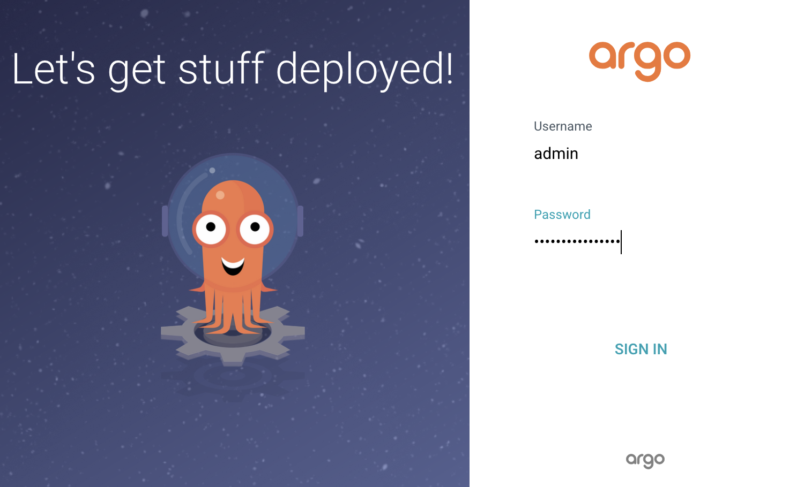
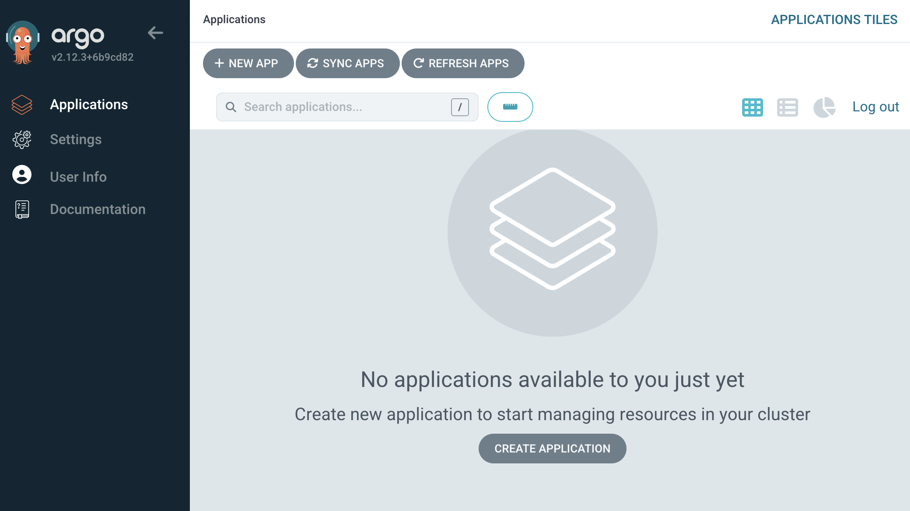
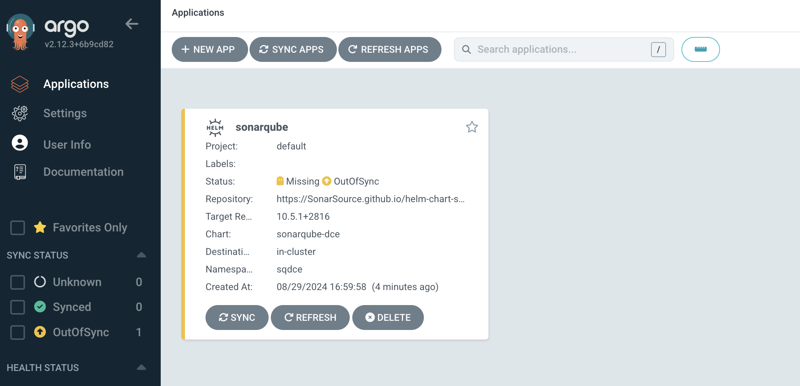
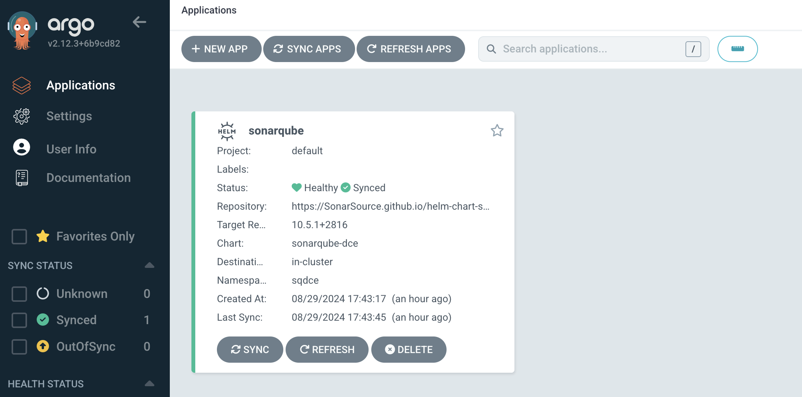
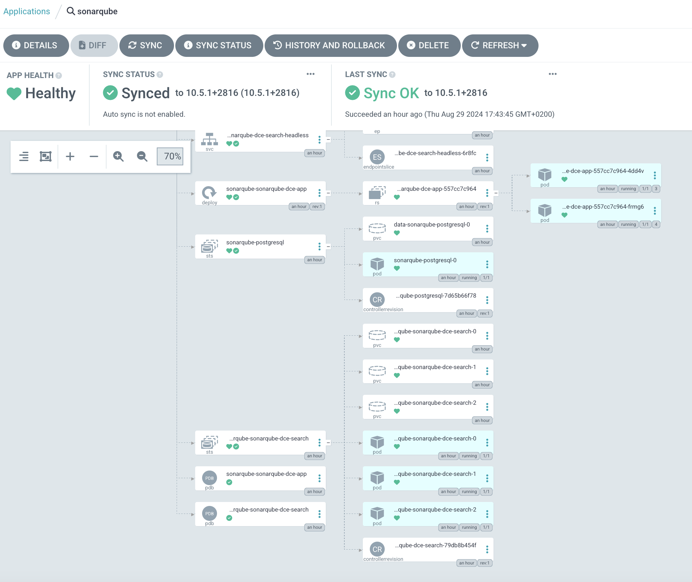
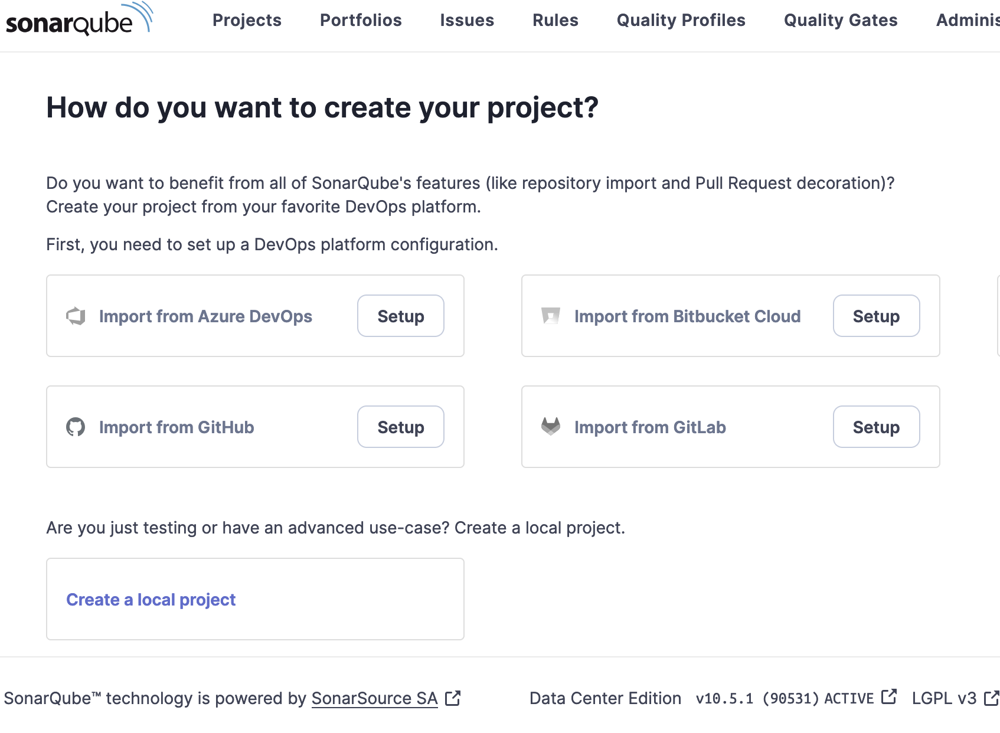

# Deploy SonarQube DCE on kubernetes cluster with Argo CD part 1


## Introduction

Argo CD is a declarative, GitOps continuous delivery tool for Kubernetes. It enables users to manage and automate the deployment of applications to Kubernetes clusters using Git repositories as the source of truth for the desired state of applications. ArgoCD continuously monitors the deployed applications and ensures that their current state matches the desired state defined in Git.

Argo CD automates the deployment of the desired application states in the specified target environments. Application deployments can track updates to branches, tags, or pinned to a specific version of manifests at a Git commit.

Using Argo CD to deploy SonarQube offers several advantages, especially within the context of DevOps and GitOps practices. Here are the key benefits:
1. Declarative Configuration

    With Argo CD, you can define your SonarQube deployment in a Git repository. This makes it easier to manage and version control your infrastructure as code.

2. GitOps Model

    Changes to the SonarQube deployment can be made through Git, allowing for a streamlined, auditable, and rollback-friendly process. This aligns closely with DevOps best practices.

3. Automated Synchronization

    Argo CD continuously monitors the state of your SonarQube deployments, automatically applying any changes committed to the Git repository, ensuring that your deployment is always up to date.

4. Rollbacks and History

     If an issue arises, Argo CD makes it easy to roll back to a previous version of SonarQube simply by reverting the changes in Git.

5. Multi-cluster Support

    Argo CD can manage deployments across multiple Kubernetes clusters from a single interface, providing flexibility in managing SonarQube instances in different environments.

6. User Interface and CLI   
   
    Argo CD provides both a web-based UI and a command-line interface (CLI), allowing users to easily monitor and manage their SonarQube deployments.

7. Access Control   
   
   Argo CD supports role-based access control (RBAC), enabling better security and access management when deploying and configuring SonarQube.

8. Integration with CI/CD  

   It easily integrates with other CI/CD tools, allowing for a streamlined workflow from code commit to deployment, enhancing productivity.

In summary, using Argo CD for deploying SonarQube can thus help organizations achieve better efficiency, reliability, and management of their CI/CD processes.


## Prerequisites

Before you get started, you’ll need to have these things:

✅ An EKS Cluster runnig and configured

✅ helm installed

✅ Kubernetes CLI (kubectl)

✅ A GitHub account (in our example), but Flux supports Git repos: AWS CodeCommit ,Azure DevOps Bitbucket Server and Data Center GitHub.com and GitHub Enterprise GitLab.com and GitLab Enterprise.

✅ A PAT ([Personal Access Token on GitHub](https://docs.github.com/en/authentication/keeping-your-account-and-data-secure/managing-your-personal-access-tokens) with all permissions under repo and workflow)


## What does this task do?

- Create a k8s namespace for SonarQube DCE
- Deployment SonarQube DCE with Argo CD
- Upgrade SonarQube DCE with Argo CD

The scenario we will use is as follows: we will install SonarQube DCE version 10.5.1 and then perform an upgrade to version 10.6.0.


## Installation


🟢 The step 1 is to install the Argo CD CLI

The Argo CD CLI is available as a binary executable for all major platforms, the binaries can be downloaded from [GitHub releases page](https://argo-cd.readthedocs.io/en/stable/cli_installation/).

With Homebrew for macOS and Linux:
```bash 
:> brew install argocd
```

🟢 The step 2 is to install Argo CD with HELM

We will perform a simple installation of Argo CD without using an Ingress controller, just the internal AWS LoadBalancer.

Add Argo CD Helm repository
```bash 
:> helm repo add argo https://argoproj.github.io/argo-helm
:> helm repo update
```

Install Argo CD
```bash 
:> kubectl create ns argocd
namespace/argocd created
:> helm install argocd argo/argo-cd --namespace argocd
NAME: argocd
LAST DEPLOYED: Thu Aug 29 11:33:27 2024
NAMESPACE: argocd
STATUS: deployed
REVISION: 1
TEST SUITE: None
NOTES:
In order to access the server UI you have the following options:

1. kubectl port-forward service/argocd-server -n argocd 8080:443

    and then open the browser on http://localhost:8080 and accept the certificate

2. enable ingress in the values file `server.ingress.enabled` and either
      - Add the annotation for ssl passthrough: https://argo-cd.readthedocs.io/en/stable/operator-manual/ingress/#option-1-ssl-passthrough
      - Set the `configs.params."server.insecure"` in the values file and terminate SSL at your ingress: https://argo-cd.readthedocs.io/en/stable/operator-manual/ingress/#option-2-multiple-ingress-objects-and-hosts


After reaching the UI the first time you can login with username: admin and the random password generated during the installation. You can find the password by running:

kubectl -n argocd get secret argocd-initial-admin-secret -o jsonpath="{.data.password}" | base64 -d

(You should delete the initial secret afterwards as suggested by the Getting Started Guide: https://argo-cd.readthedocs.io/en/stable/getting_started/#4-login-using-the-cli)
```

Modify Argo CD Service for AWS Internal LoadBalancer

```bash 
:> kubectl patch svc argocd-server -n argocd -p '{"spec": {"type": "LoadBalancer", "annotations": {"service.beta.kubernetes.io/aws-load-balancer-internal": "true"}}}'
service/argocd-server patched
```

❗️ This patch is specific to AWS; for Azure, Google, etc., you will need to apply other patches related to the platform.

✅ Check Installation :

The installation created a flux-system namespace. To verify if Flux is properly deployed, run the following command:

```bash 
:> kubectl -n argocd get all
                                                                                                                                        
NAME                                                   READY   STATUS    RESTARTS   AGE
pod/argocd-application-controller-0                    1/1     Running   0           6m
pod/argocd-applicationset-controller-669658889-r5rgf   1/1     Running   0           6m
pod/argocd-dex-server-7455d97fb4-npxnf                 1/1     Running   0           6m
pod/argocd-notifications-controller-5dd45b586b-jl69q   1/1     Running   0           6m
pod/argocd-redis-768f57bdfb-chk9k                      1/1     Running   0           6m
pod/argocd-repo-server-d4ff4d9bf-lnvfl                 1/1     Running   0           6m
pod/argocd-server-9f896c744-drtgt                      1/1     Running   0           6m

NAME                                       TYPE           CLUSTER-IP       EXTERNAL-IP             PORT(S)                      AGE
service/argocd-applicationset-controller   ClusterIP      10.100.213.232   <none>                  7000/TCP                      6m
service/argocd-dex-server                  ClusterIP      10.100.64.172    <none>                  5556/TCP,5557/TCP             6m
service/argocd-redis                       ClusterIP      10.100.22.208    <none>                  6379/TCP                      6m
service/argocd-repo-server                 ClusterIP      10.100.240.9     <none>                  8081/TCP                      6m
service/argocd-server                      LoadBalancer   10.100.82.202    X.X.X.X.amazonaws.com   80:31159/TCP,443:30361/TCP    6m

NAME                                               READY   UP-TO-DATE   AVAILABLE   AGE
deployment.apps/argocd-applicationset-controller   1/1     1            1            6m
deployment.apps/argocd-dex-server                  1/1     1            1            6m
deployment.apps/argocd-notifications-controller    1/1     1            1            6m
deployment.apps/argocd-redis                       1/1     1            1            6m
deployment.apps/argocd-repo-server                 1/1     1            1            6m
deployment.apps/argocd-server                      1/1     1            1            6m

NAME                                                         DESIRED   CURRENT   READY   AGE
replicaset.apps/argocd-applicationset-controller-669658889   1         1         1       6m
replicaset.apps/argocd-dex-server-7455d97fb4                 1         1         1       6m
replicaset.apps/argocd-notifications-controller-5dd45b586b   1         1         1       6m
replicaset.apps/argocd-redis-768f57bdfb                      1         1         1       6m
replicaset.apps/argocd-repo-server-d4ff4d9bf                 1         1         1       6m
replicaset.apps/argocd-server-9f896c744                      1         1         1       6m

NAME                                             READY   AGE
statefulset.apps/argocd-application-controller   1/1      6m
```

✅ We can check if Argo SC service running :

```bash 
:> kubectl -n argocd get svc argocd-server

NAME            TYPE           CLUSTER-IP    EXTERNAL-IP                                  PORT(S)               AGE
argocd-server   LoadBalancer   10.X.X.X    xxxx.eu-central-1.elb.amazonaws.com    80:31159/TCP,443:30361/TCP    8m
:> 
```

We need to recover the administrator password which was set by default :
```bash 
:> kubectl -n argocd get secret argocd-initial-admin-secret -o jsonpath="{.data.password}" | base64 -d
xxxxxxxxxxxxx
```

😀 Now you can connect to the Argo CD instance at the following url sample:

http://xxxx.eu-central-1.elb.amazonaws.com






🟢 Step 3: Prepare the environment to deploy sonarqube

Created a namespace :

```bash 
:> kubectl create ns sqdce 
namespace/sonarqubedce created
>
```
Created a secret to store the application authentication JWT token :

```bash 
:> export JWT_SECRET=$(echo -n "your_secret" | openssl dgst -sha256 -hmac "your_key" -binary | base64)
:> kubectl -n sqdce  create secret generic sonarqube-dce-auth-jwt --from-literal=SONAR_AUTH_JWTBASE64HS256SECRET=${JWT_SECRET}
secret/sonarqube-dce-auth-jwt created
>
```

The configuration of the SonarQube helm chart will be as follows : 


```yaml
searchNodes:
  persistence:
    storageClassName: "managed-csi"

service:
  type: LoadBalancer
  externalPort: 9000
  internalPort: 9000
  labels:
  annotations: 
   service.beta.kubernetes.io/aws-load-balancer-scheme: "internet-facing"
   service.beta.kubernetes.io/aws-load-balancer-type: nlb

postgresql:
 image:
  tag: 11.22.0-debian-11-r4
```


❗️ In this deployment, we are not using an external database, this is just to simplify the example. If you want to use an external database or a pre-existing instance in your cluster, you will need to set:
```yaml
postgresql: 
  enabled: false
```
and reference the JDBC configuration as indicated in the [values.yaml](https://github.com/SonarSource/helm-chart-sonarqube/blob/master/charts/sonarqube-dce/values.yaml).Example :

```yaml

 jdbcOverwrite:
      enable: true
      # The JDBC url of the external DB
      jdbcUrl: ${jdbc_url} # has to be changed according to environment
      # The DB user that should be used for the JDBC connection
      jdbcUsername: postgres
      # Use pre-existing k8s secret containing the DB password
      jdbcSecretName: sonarqube-dce-db-credentials-es
      # and the secretValueKey of the password found within that secret
      jdbcSecretPasswordKey: sonarqube_dce_db_instance_password
```
❗️ For PostgreSQL, we specified the version because if you have an ARM-based Kubernetes cluster, the default version deployed by the SonarQube Helm chart does not support ARM architecture.

❗️ In this deployment, I am using a load balancer, and the settings are specific to an AWS environment.We have created a secret to store the application authentication JWT token.

❗️ On our Kubernetes server, we use a specific storage class : **managed-csi**

❗️ To determine the chart version of the SonarQube , you need to run the following command:

```bash 
:> helm search repo sonarqube/sonarqube-dce --versions
NAME                    CHART VERSION   APP VERSION     DESCRIPTION                                       
sonarqube/sonarqube-dce 10.6.0+3033     10.6.0          SonarQube is a self-managed, automatic code rev...
sonarqube/sonarqube-dce 10.5.1+2816     10.5.1          SonarQube is a self-managed, automatic code rev...
sonarqube/sonarqube-dce 10.5.0+2748     10.5.0          SonarQube is a self-managed, automatic code rev...
....
:> 
```
❗️ Of course, before running this command, you need to have added the Helm repository to your Helm registry.
```bash 
:> helm repo add sonarqube https://SonarSource.github.io/helm-chart-sonarqube
:> helm repo update
:> 
```


🟢 The step 5 : creation of a sonarqube application for argocd

We will now create an Argo CD application for deploying SonarQube. We will use the Argo CD CLI, but we could have done it through the web interface.

❗️ The first step is to connect :

```bash 
:> argocd login <ip_adress_service_argocd> --username admin --password <your_password>
WARNING: server certificate had error: tls: failed to verify certificate: x509: certificate signed by unknown authority. Proceed insecurely (y/n)? y
'admin:login' logged in successfully
:> 
```

❗️ The second step create a sonarqube Argo CD Application :

```bash 
:> argocd app create sonarqube \
  --repo https://SonarSource.github.io/helm-chart-sonarqube \
  --dest-server https://kubernetes.default.svc \
  --dest-namespace sqdce  \
  --helm-chart sonarqube-dce \
  --revision 10.5.1+2816 \
  --helm-set searchNodes.persistence.storageClassName=managed-csi \
  --helm-set ApplicationNodes.existingJwtSecret=sonarqube-dce-auth-jwt \
  --helm-set service.type=LoadBalancer \
  --helm-set service.externalPort=9000 \
  --helm-set service.internalPort=9000 \
  --helm-set service.annotations."service.beta.kubernetes.io/aws-load-balancer-scheme"=internet-facing \
  --helm-set service.annotations."service.beta.kubernetes.io/aws-load-balancer-type"=nlb \
  --helm-set postgresql.image.tag=11.22.0-debian-11-r4
application 'sonarqube' created  
```

Your app should now appear when running argocd app list:

```bash 
:> argocd app list
NAME              CLUSTER                         NAMESPACE  PROJECT  STATUS     HEALTH   SYNCPOLICY  CONDITIONS  REPO                                                PATH  TARGET
argocd/sonarqube  https://kubernetes.default.svc   sqdce     default  OutOfSync  Missing  Manual      <none>      https://SonarSource.github.io/
 PATH                         TARGET
helm-chart-sonarqube        10.5.1+2816
:>
```

It’ll also be presented in the Argo web UI:




The app shows as Missing and Out of Sync. So far, we’ve only registered the app with Argo: a separate sync operation is required to actually create the resources in your Kubernetes cluster. Press the Sync or Sync Apps button in the UI, or use the argocd app sync command, to start your initial sync.

```bash 
:> argocd app sync sonarqube
........
```

After a few minutes, our application is synchronized and up and running 💚 ✅.






Sonarqube version 10.5.1 is well deployed and operational from Argo CD.

✅ We can check if SonarQube is deployed :
```bash 
:> kubectl -n sqdce get pods
NAME                                               READY   STATUS    RESTARTS      AGE
sonarqube-dce-postgresql-0                         1/1     Running   0             6m
sonarqube-dce-sonarqube-dce-app-599595fcf5-n6kzf   1/1     Running   4 (5m ago)    5m
sonarqube-dce-sonarqube-dce-app-599595fcf5-txtnw   1/1     Running   4 (5m ago)    5m
sonarqube-dce-sonarqube-dce-search-0               1/1     Running   0             5m
sonarqube-dce-sonarqube-dce-search-1               1/1     Running   0             5m
sonarqube-dce-sonarqube-dce-search-2               1/1     Running   0             5m
:flux-sonarqube>
```
We can check if SonarQube service running :
```bash 
:> kubectl -n sqdce get svc sonarqube-dce-sonarqube-dce

NAME                          TYPE           CLUSTER-IP      EXTERNAL-IP                   PORT(S)      AGE
sonarqube-dce-sonarqube-dce   LoadBalancer   10.X.X.X    k8s-sqdce-sonarqub-xxxx.com   9000:31935/TCP   111m
:>
```
😀 Now you can connect to the SonarQube instance (version 10.5.1) at the following url sample:

http://k8s-sonarqub-xxxx.com:9000



----
## Troubleshooting


✳️ Check Argo CD logs:

Run the following commands to check the status of resources in the argocd namespace
```bash 
:>  kubectl logs -n argocd argocd-server-xxxx
:>
```

✳️ Show Argo CD events 
```bash 
:flux-sonarqube> kubectl get events -n argocd 
```


----
✅ Ressources

🏠 [SonarQube HELM](https://github.com/SonarSource/helm-chart-sonarqube/tree/master/charts)

🏠 [Argo CD](https://argo-cd.readthedocs.io/en/stable/operator-manual/installation/)

🏠 [Argo CD cli](https://argo-cd.readthedocs.io/en/stable/user-guide/commands/argocd/)

🏠 [Troubleshooting](https://argo-cd.readthedocs.io/en/stable/operator-manual/troubleshooting/)

 📌 You will find the YAML files used for this deployment in the **manifests** directory.


-----
<table>
<tr style="border: 0px transparent">
    <td style="border: 0px transparent"> <a href="../README.md" title="home">⬅ Previous</a></td><td style="border: 0px transparent"><a href="upgrade.md" title="Upgrade SonarQube DCE with FluxCDArgo CD part 2">Next ➡</a></td><td style="border: 0px transparent"><a href="../README.md" title="home">🏠</a></td>
</tr>

</table>
