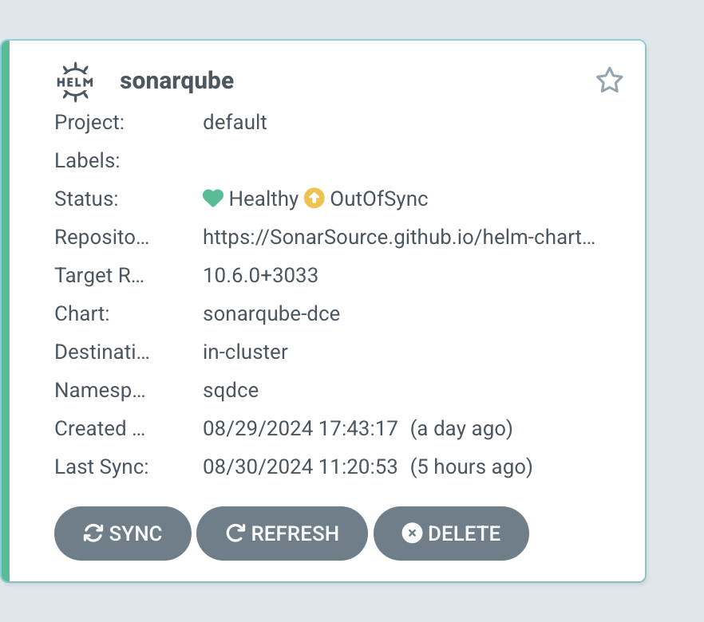
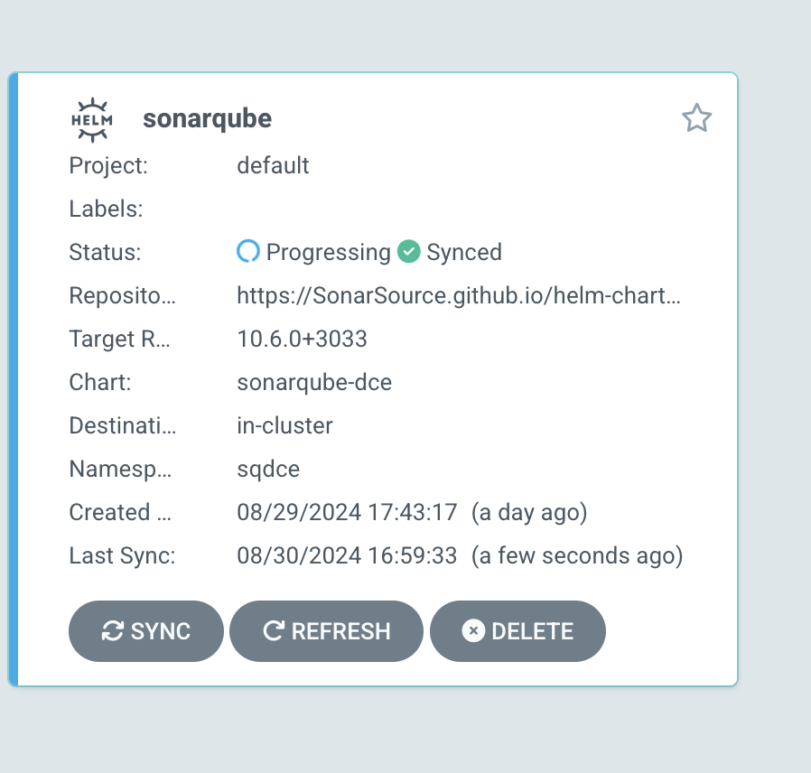
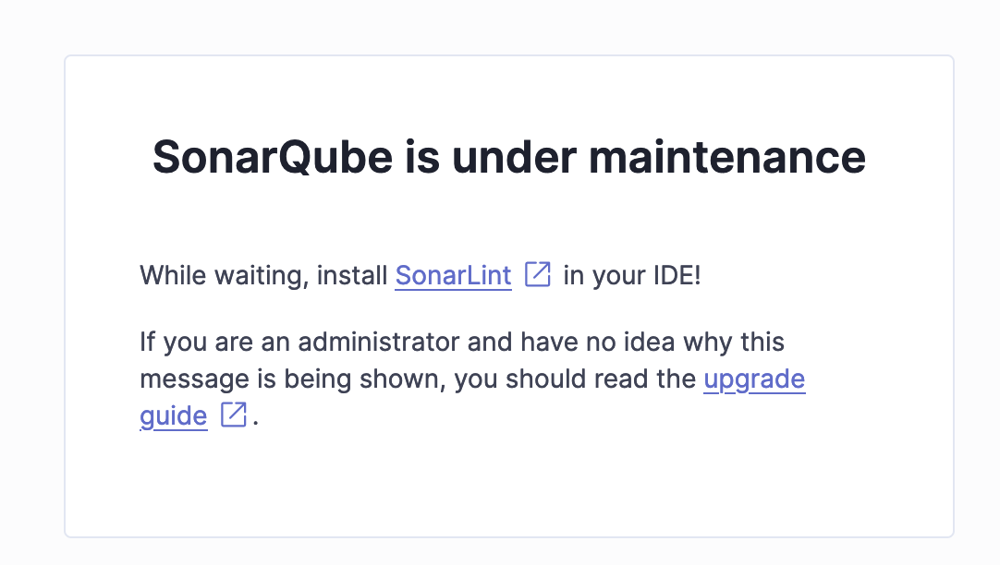
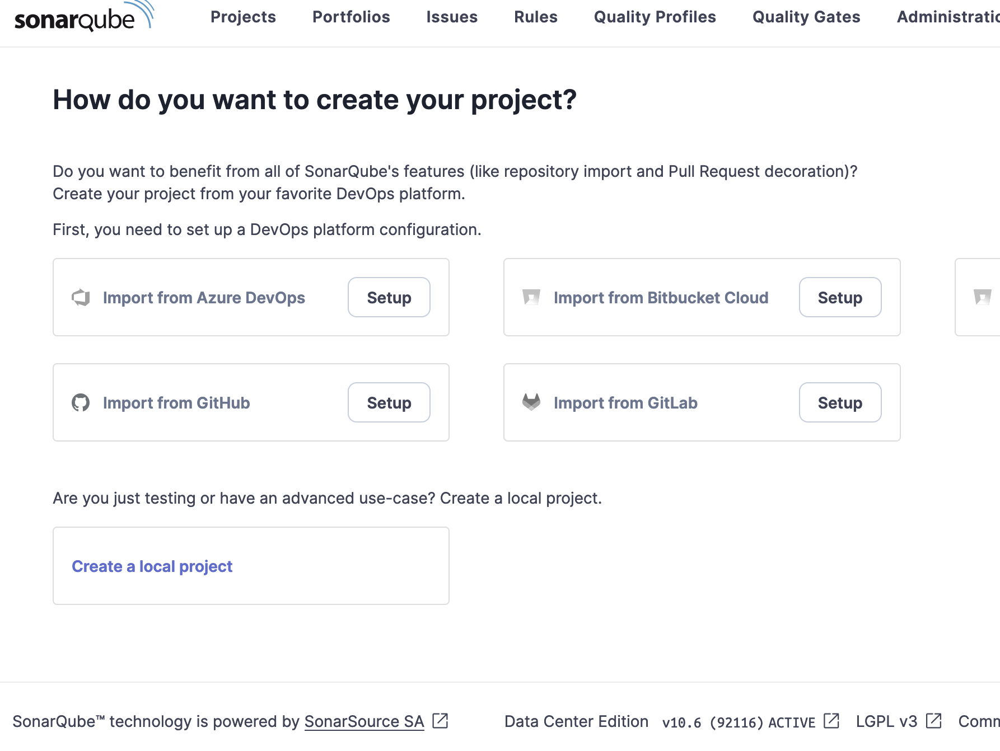
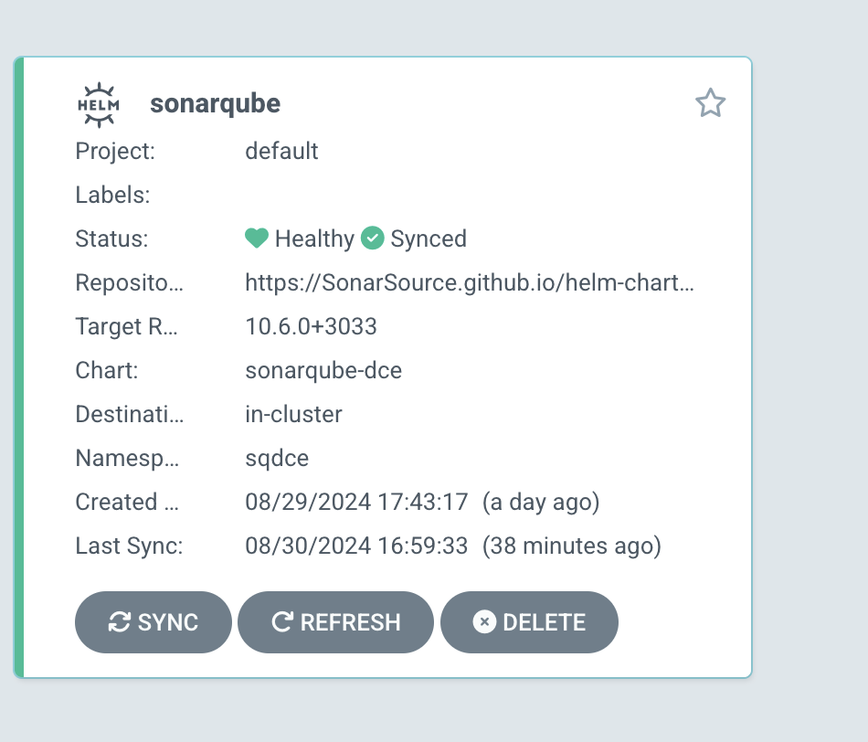
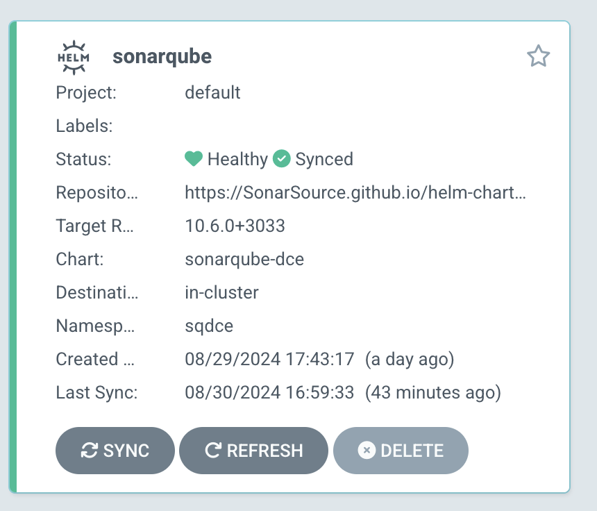

# Deploy SonarQube DCE on kubernetes cluster with Argo CD part 2


Login to Argo CD: Ensure you are logged into your Argo CD server.

```bash 
:> argocd login <ip_adress_service_argocd> --username admin --password <your_password>
WARNING: server certificate had error: tls: failed to verify certificate: x509: certificate signed by unknown authority. Proceed insecurely (y/n)? y
'admin:login' logged in successfully
:> 
```

Update the Application to Use the New Version: Use the argocd app set command to change the Helm chart revision for your application. The --helm-repo option is not needed unless you are changing the repository itself.

Here’s the command to update the SonarQube application's chart version to 10.6.0+3033:

```bash 
:> argocd app set sonarqube --revision 10.6.0+3033
:>
```

Sonarqube run but the application is not sync with 10.6.0 release

Your app should now appear when running argocd app list:

```bash 
:> argocd app list
NAME              CLUSTER                         NAMESPACE         PROJECT  STATUS     HEALTH   SYNCPOLICY  CONDITIONS  REPO                                               
argocd/sonarqube  https://kubernetes.default.svc    sqdce      default  OutOfSync  Healthy  Manual      <none>      https://SonarSource.github.io/
 PATH                         TARGET
helm-chart-sonarqube        10.6.0+3033
:>
```

It’ll also be presented in the Argo web UI:



The application shows as running and out of sync. A separate sync operation is required to actually create the upgrade to 10.6.0 in your Kubernetes cluster. Press the Sync or Sync Apps button in the UI, or use the argocd app sync command to start your sync.


Verify the Upgrade: You can check the application status to ensure that the upgrade was successful:

```bash 
:> ArgoCD % argocd app get sonarqube
Name:               argocd/sonarqube
Project:            default
Server:             https://kubernetes.default.svc
Namespace:          sqdce
URL:                https://argocd.example.com/applications/sonarqube
Source:
- Repo:             https://SonarSource.github.io/helm-chart-sonarqube
  Target:           10.6.0+3033
SyncWindow:         Sync Allowed
Sync Policy:        Manual
Sync Status:        Synced to 10.6.0+3033 (10.6.0+)
Health Status:      Progressing

GROUP   KIND                 NAMESPACE  NAME                                         STATUS  HEALTH       HOOK  MESSAGE
policy  PodDisruptionBudget  sqdce      sonarqube-sonarqube-dce-search               Synced                     poddisruptionbudget.policy/sonarqube-sonarqube-dce-search configured
policy  PodDisruptionBudget  sqdce      sonarqube-sonarqube-dce-app                  Synced                     poddisruptionbudget.policy/sonarqube-sonarqube-dce-app configured
        Secret               sqdce      sonarqube-postgresql                         Synced                     secret/sonarqube-postgresql configured
        Secret               sqdce      sonarqube-sonarqube-dce-monitoring-passcode  Synced                     secret/sonarqube-sonarqube-dce-monitoring-passcode configured
        ConfigMap            sqdce      sonarqube-sonarqube-dce-install-plugins      Synced                     configmap/sonarqube-sonarqube-dce-install-plugins configured
        ConfigMap            sqdce      sonarqube-sonarqube-dce-jdbc-config          Synced                     configmap/sonarqube-sonarqube-dce-jdbc-config configured
        ConfigMap            sqdce      sonarqube-sonarqube-dce-search-config        Synced                     configmap/sonarqube-sonarqube-dce-search-config configured
        ConfigMap            sqdce      sonarqube-sonarqube-dce-app-config           Synced                     configmap/sonarqube-sonarqube-dce-app-config configured
        ConfigMap            sqdce      sonarqube-sonarqube-dce-init-fs              Synced                     configmap/sonarqube-sonarqube-dce-init-fs configured
        ConfigMap            sqdce      sonarqube-sonarqube-dce-init-sysctl          Synced                     configmap/sonarqube-sonarqube-dce-init-sysctl configured
        Service              sqdce      sonarqube-postgresql-headless                Synced  Healthy            service/sonarqube-postgresql-headless unchanged
        Service              sqdce      sonarqube-postgresql                         Synced  Healthy            service/sonarqube-postgresql unchanged
        Service              sqdce      sonarqube-sonarqube-dce-search               Synced  Healthy            service/sonarqube-sonarqube-dce-search configured
        Service              sqdce      sonarqube-sonarqube-dce-headless             Synced  Healthy            service/sonarqube-sonarqube-dce-headless configured
        Service              sqdce      sonarqube-sonarqube-dce                      Synced  Healthy            service/sonarqube-sonarqube-dce configured
        Service              sqdce      sonarqube-sonarqube-dce-search-headless      Synced  Healthy            service/sonarqube-sonarqube-dce-search-headless configured
apps    Deployment           sqdce      sonarqube-sonarqube-dce-app                  Synced  Progressing        deployment.apps/sonarqube-sonarqube-dce-app configured
apps    StatefulSet          sqdce      sonarqube-postgresql                         Synced  Healthy            statefulset.apps/sonarqube-postgresql configured
apps    StatefulSet          sqdce      sonarqube-sonarqube-dce-search               Synced  Progressing        statefulset.apps/sonarqube-sonarqube-dce-search configured
:> 
```
Or in the Argo web UI:



The deployment is in progress, after a few minutes the deployment is almost operational, we have the sonarqube-sonarqube-dce-app deployment which is in a "synced Progressing" state, which is normal because we must manually upgrade the database

```bash 

:> argocd app get sonarqube                                                  
Name:               argocd/sonarqube
Project:            default
Server:             https://kubernetes.default.svc
Namespace:          sqdce
URL:                https://argocd.example.com/applications/sonarqube
Source:
- Repo:             https://SonarSource.github.io/helm-chart-sonarqube
  Target:           10.6.0+3033
SyncWindow:         Sync Allowed
Sync Policy:        Manual
Sync Status:        Synced to 10.6.0+3033 (10.6.0+)
Health Status:      Progressing

GROUP   KIND                 NAMESPACE  NAME                                         STATUS  HEALTH       HOOK  MESSAGE
policy  PodDisruptionBudget  sqdce      sonarqube-sonarqube-dce-search               Synced                     poddisruptionbudget.policy/sonarqube-sonarqube-dce-search configured
policy  PodDisruptionBudget  sqdce      sonarqube-sonarqube-dce-app                  Synced                     poddisruptionbudget.policy/sonarqube-sonarqube-dce-app configured
        Secret               sqdce      sonarqube-postgresql                         Synced                     secret/sonarqube-postgresql configured
        Secret               sqdce      sonarqube-sonarqube-dce-monitoring-passcode  Synced                     secret/sonarqube-sonarqube-dce-monitoring-passcode configured
        ConfigMap            sqdce      sonarqube-sonarqube-dce-install-plugins      Synced                     configmap/sonarqube-sonarqube-dce-install-plugins configured
        ConfigMap            sqdce      sonarqube-sonarqube-dce-jdbc-config          Synced                     configmap/sonarqube-sonarqube-dce-jdbc-config configured
        ConfigMap            sqdce      sonarqube-sonarqube-dce-search-config        Synced                     configmap/sonarqube-sonarqube-dce-search-config configured
        ConfigMap            sqdce      sonarqube-sonarqube-dce-app-config           Synced                     configmap/sonarqube-sonarqube-dce-app-config configured
        ConfigMap            sqdce      sonarqube-sonarqube-dce-init-fs              Synced                     configmap/sonarqube-sonarqube-dce-init-fs configured
        ConfigMap            sqdce      sonarqube-sonarqube-dce-init-sysctl          Synced                     configmap/sonarqube-sonarqube-dce-init-sysctl configured
        Service              sqdce      sonarqube-postgresql-headless                Synced  Healthy            service/sonarqube-postgresql-headless unchanged
        Service              sqdce      sonarqube-postgresql                         Synced  Healthy            service/sonarqube-postgresql unchanged
        Service              sqdce      sonarqube-sonarqube-dce-search               Synced  Healthy            service/sonarqube-sonarqube-dce-search configured
        Service              sqdce      sonarqube-sonarqube-dce-headless             Synced  Healthy            service/sonarqube-sonarqube-dce-headless configured
        Service              sqdce      sonarqube-sonarqube-dce                      Synced  Healthy            service/sonarqube-sonarqube-dce configured
        Service              sqdce      sonarqube-sonarqube-dce-search-headless      Synced  Healthy            service/sonarqube-sonarqube-dce-search-headless configured
apps    Deployment           sqdce      sonarqube-sonarqube-dce-app                  Synced  Progressing        deployment.apps/sonarqube-sonarqube-dce-app configured
apps    StatefulSet          sqdce      sonarqube-postgresql                         Synced  Healthy            statefulset.apps/sonarqube-postgresql configured
apps    StatefulSet          sqdce      sonarqube-sonarqube-dce-search               Synced  Healthy            statefulset.apps/sonarqube-sonarqube-dce-search configured
:> 
```

📌 Step 4 : Upgrade a SonarQube database.



You need to execute this URL in your browser (use the SonarQube service connection URL).

http://k8s-sonarqub-xxxx.com:9000/setup

🤔 If you don't remember the SonarQube connection URL, the command to retrieve it is:

```bash 
:> kubectl -n sqdce get svc sonarqube-dce-sonarqube-dce

NAME                          TYPE           CLUSTER-IP      EXTERNAL-IP                   PORT(S)      AGE
sonarqube-dce-sonarqube-dce   LoadBalancer   10.X.X.X    k8s-sqdce-sonarqub-xxxx.com   9000:31935/TCP   111m
:>
```

 After a few minutes you can connect to the SonarQube instance 😀



Check the status in Argo CD :

 
```bash 
:> argocd app get sonarqube
Name:               argocd/sonarqube
Project:            default
Server:             https://kubernetes.default.svc
Namespace:          sqdce
URL:                https://argocd.example.com/applications/sonarqube
Source:
- Repo:             https://SonarSource.github.io/helm-chart-sonarqube
  Target:           10.6.0+3033
SyncWindow:         Sync Allowed
Sync Policy:        Manual
Sync Status:        Synced to 10.6.0+3033 (10.6.0+)
Health Status:      Healthy

GROUP   KIND                 NAMESPACE  NAME                                         STATUS  HEALTH   HOOK  MESSAGE
policy  PodDisruptionBudget  sqdce      sonarqube-sonarqube-dce-search               Synced                 poddisruptionbudget.policy/sonarqube-sonarqube-dce-search configured
policy  PodDisruptionBudget  sqdce      sonarqube-sonarqube-dce-app                  Synced                 poddisruptionbudget.policy/sonarqube-sonarqube-dce-app configured
        Secret               sqdce      sonarqube-postgresql                         Synced                 secret/sonarqube-postgresql configured
        Secret               sqdce      sonarqube-sonarqube-dce-monitoring-passcode  Synced                 secret/sonarqube-sonarqube-dce-monitoring-passcode configured
        ConfigMap            sqdce      sonarqube-sonarqube-dce-install-plugins      Synced                 configmap/sonarqube-sonarqube-dce-install-plugins configured
        ConfigMap            sqdce      sonarqube-sonarqube-dce-jdbc-config          Synced                 configmap/sonarqube-sonarqube-dce-jdbc-config configured
        ConfigMap            sqdce      sonarqube-sonarqube-dce-search-config        Synced                 configmap/sonarqube-sonarqube-dce-search-config configured
        ConfigMap            sqdce      sonarqube-sonarqube-dce-app-config           Synced                 configmap/sonarqube-sonarqube-dce-app-config configured
        ConfigMap            sqdce      sonarqube-sonarqube-dce-init-fs              Synced                 configmap/sonarqube-sonarqube-dce-init-fs configured
        ConfigMap            sqdce      sonarqube-sonarqube-dce-init-sysctl          Synced                 configmap/sonarqube-sonarqube-dce-init-sysctl configured
        Service              sqdce      sonarqube-postgresql-headless                Synced  Healthy        service/sonarqube-postgresql-headless unchanged
        Service              sqdce      sonarqube-postgresql                         Synced  Healthy        service/sonarqube-postgresql unchanged
        Service              sqdce      sonarqube-sonarqube-dce-search               Synced  Healthy        service/sonarqube-sonarqube-dce-search configured
        Service              sqdce      sonarqube-sonarqube-dce-headless             Synced  Healthy        service/sonarqube-sonarqube-dce-headless configured
        Service              sqdce      sonarqube-sonarqube-dce                      Synced  Healthy        service/sonarqube-sonarqube-dce configured
        Service              sqdce      sonarqube-sonarqube-dce-search-headless      Synced  Healthy        service/sonarqube-sonarqube-dce-search-headless configured
apps    Deployment           sqdce      sonarqube-sonarqube-dce-app                  Synced  Healthy        deployment.apps/sonarqube-sonarqube-dce-app configured
apps    StatefulSet          sqdce      sonarqube-postgresql                         Synced  Healthy        statefulset.apps/sonarqube-postgresql configured
apps    StatefulSet          sqdce      sonarqube-sonarqube-dce-search               Synced  Healthy        statefulset.apps/sonarqube-sonarqube-dce-search configured
 
```
Or in the Argo web UI:



-----

✅ Clean Up resources

For clean up platform please run this command :

```bash 
:> argocd app delete sonarqube --cascade --yes
```
Confirm Deletion (if required): If prompted to confirm the deletion, type yes to proceed. If you want to skip this confirmation prompt, you can use the --cascade option along with --yes to automatically confirm the deletion of any resources associated with the application.

Or Delete Apps button in the UI, or use the argocd app sync command 

Verify Deletion: To confirm the application has been deleted, you can list all applications:
```bash 
:> argocd app list
```


----

## Conclusion

AUsing Argo CD to deploy and manage SonarQube enhances your operational efficiency, reduces deployment complexities, and provides robust management capabilities. By adhering to GitOps principles, it enables a more reliable and auditable process for application delivery. As organizations increasingly embrace DevOps practices, Argo CD integrates seamlessly into modern CI/CD pipelines, making it a valuable tool for reliable software delivery and operational excellence.


-----
<table>
<tr style="border: 0px transparent">
    <td style="border: 0px transparent"> <a href="README.md" title="Upgrade SonarQube DCE with Argo CD part 1">⬅ Previous</a></td><td style="border: 0px transparent"><a href="../README.md" title="home">🏠</a></td>
</tr>

</table>