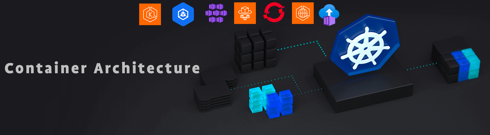

 

# Comparative Document: Container Solutions by Azure, AWS, Google Cloud, and OpenShift

## ✅ Introduction
Containers have become a crucial solution for deploying and managing modern applications. They offer increased portability and simplified dependency management. The leading cloud providers—Azure, AWS, and Google Cloud—offer various container solutions. Additionally, OpenShift, a Kubernetes-based platform from Red Hat, provides a comprehensive enterprise solution. This document compares the main options provided by these vendors.

## ✅ Amazon Web Services (AWS) 
AWS offers several services for container management:

### Amazon ECS (Elastic Container Service)
- **Description**: Fully managed container orchestration service that allows you to deploy, manage, and scale containerized applications.
- **Advantages**:
  - Native integration with other AWS services.
  - High performance and scalability.
  - Flexible deployment options (ECS on EC2, ECS Anywhere).
- **Limitations**:
  - Complexity in managing underlying EC2 instances if used without Fargate.

### Amazon ECS Fargate
- **Description**: Serverless compute engine for Amazon ECS that allows you to focus on deploying containers without managing the underlying servers.
- **Advantages**:
  - No infrastructure management.
  - Pay-as-you-go pricing.
  - Automatic scaling.
- **Limitations**:
  - Potentially higher costs compared to managing EC2 instances directly.

### Amazon EKS (Elastic Kubernetes Service)
- **Description**: Managed Kubernetes service that makes it easy to run Kubernetes on AWS without managing the control plane.
- **Advantages**:
  - Full Kubernetes compatibility.
  - Native integration with AWS services.
  - Enhanced security and compliance.
- **Limitations**:
  - Steep learning curve for Kubernetes.
  - Cost of control plane service.

## ✅ Microsoft Azure
Azure offers several services for container management:

### Azure Kubernetes Service (AKS)
- **Description**: Managed Kubernetes service that simplifies deploying, managing, and operating Kubernetes.
- **Advantages**:
  - Integration with Azure DevOps and other Azure services.
  - Automated updates and patches.
  - High availability and auto-recovery.
- **Limitations**:
  - Initial setup complexity.
  - Dependency on the Azure ecosystem.

### Azure Container Instances (ACI)
- **Description**: Serverless container service that lets you run containers without managing the underlying servers.
- **Advantages**:
  - Rapid, on-demand deployment.
  - Pay-as-you-go billing.
  - Integration with other Azure services like Azure Logic Apps.
- **Limitations**:
  - Limitations on advanced networking features.
  - No built-in orchestrator management.

## ✅ Google Cloud Platform (GCP)
Google Cloud also offers several services for container management:

### Google Kubernetes Engine (GKE)
- **Description**: Managed Kubernetes service that provides a ready-to-use environment for deploying and managing Kubernetes clusters.
- **Advantages**:
  - Deep integration with Google Cloud.
  - Advanced monitoring and management tools.
  - Automatic control plane updates.
- **Limitations**:
  - Complexity of Kubernetes.
  - Costs associated with control plane and nodes.

### Google Cloud Run
- **Description**: Serverless container service that automatically scales containers based on load.
- **Advantages**:
  - No server management.
  - Integration with CI/CD via Google Cloud Build.
  - Support for Knative containers.
- **Limitations**:
  - Limitations on execution durations.
  - Less control over infrastructure.

## ✅ Red Hat OpenShift
OpenShift provides a comprehensive Kubernetes-based container platform for enterprises:

### OpenShift Container Platform
- **Description**: Kubernetes-based platform for deploying, managing, and scaling containerized applications with additional enterprise features.
- **Advantages**:
  - Full Kubernetes compatibility with added enterprise features.
  - Developer-friendly tools and CI/CD integration.
  - Strong security features including integrated logging and monitoring.
- **Limitations**:
  - Requires management of underlying infrastructure if not using OpenShift Dedicated or OpenShift Online.
  - Higher complexity and cost for on-premises deployments.

### OpenShift Dedicated
- **Description**: Fully managed OpenShift service on AWS or Google Cloud.
- **Advantages**:
  - Managed infrastructure.
  - High availability and scalability.
  - Integration with cloud provider services.
- **Limitations**:
  - Higher cost compared to self-managed OpenShift.
  - Dependency on specific cloud providers.

### OpenShift Online
- **Description**: Public cloud-based OpenShift service.
- **Advantages**:
  - Easy to start with no infrastructure management.
  - Pay-as-you-go pricing.
  - Developer-focused features and integrations.
- **Limitations**:
  - Limited control over the underlying infrastructure.
  - May have limitations on scalability for larger enterprises.

## ✅ Comparison Table

| **Feature**              | **AWS ECS**        | **AWS Fargate**     | **AWS EKS**         | **Azure AKS**      | **Azure ACI**      | **GCP GKE**        | **GCP Cloud Run**   | **OpenShift Container Platform** | **OpenShift Dedicated** | **OpenShift Online** |
|--------------------------|--------------------|---------------------|---------------------|--------------------|--------------------|--------------------|---------------------|------------------------------|------------------------|----------------------|
| **Server Management**    | Manual             | Automatic           | Manual              | Manual             | Automatic          | Manual             | Automatic           | Manual                      | Automatic              | Automatic            |
| **Orchestration**        | ECS                | ECS                 | Kubernetes          | Kubernetes         | None               | Kubernetes         | None                | Kubernetes                  | Kubernetes              | Kubernetes            |
| **Scalability**          | High               | High                | High                | High               | High               | High               | High                | High                        | High                   | High                 |
| **Billing**              | Per instance       | Pay-as-you-go       | Per instance + control plane | Per instance       | Pay-as-you-go       | Per instance + control plane | Pay-as-you-go        | Subscription/Per instance   | Subscription            | Pay-as-you-go        |
| **Integration**          | AWS                | AWS                 | AWS                 | Azure              | Azure              | Google Cloud       | Google Cloud        | Broad integration (cloud/on-prem) | Cloud providers (AWS, GCP) | N/A                 |
| **Ease of Use**          | Moderate           | High                | Moderate            | Moderate           | High               | Moderate           | High                | Moderate                    | High                   | High                 |
| **Enterprise Features**  | Moderate           | Moderate            | High                | High               | Moderate           | High               | Moderate            | High                        | High                   | Moderate             |

## ✅ Conclusion
The choice of container solution depends on your specific needs, management preferences, and budget. AWS offers a wide range of services with flexible management options. Azure stands out with its tight integrations with other Microsoft services and ease of use. Google Cloud focuses on Kubernetes with robust tools for management and automation. OpenShift provides a comprehensive enterprise-grade Kubernetes platform with additional features and flexibility for various deployment scenarios.

---

## ✅ Ressources

🔗 [PDF Document](https://github.com/emmanuel-colussi-sonarsource/Container_Architecture/blob/main/Comparative_Document/export/container_solutions_comparison.pdf) 

🔗 [AWS ECS](https://docs.aws.amazon.com/ecs/)

🔗 [AWS ECS Fargate](https://docs.aws.amazon.com/AmazonECS/latest/developerguide/AWS_Fargate.html)

🔗 [Sonarqube on AWS ECS Fargate](https://github.com/colussim/AWS_ECS_FARGATE_SONARQUBE)

🔗 [AWS EKS](https://docs.aws.amazon.com/eks/)

🔗 [Azure AKS](https://learn.microsoft.com/en-us/azure/aks/)

🔗 [Azure ACI](https://learn.microsoft.com/en-us/azure/container-instances/)

🔗 [Google GKE](https://cloud.google.com/kubernetes-engine/docs)

🔗 [Google GCP Cloud Run](https://cloud.google.com/run/docs)

🔗 [OpenShift Container Platform](https://docs.openshift.com/container-platform/4.15/welcome/index.html)

🔗 [OpenShift Kubernetes](https://docs.openshift.com/container-platform/4.15/welcome/oke_about.html)

🔗 [OpenShift Documentation](https://docs.openshift.com/)

-----
<table>
<tr style="border: 0px transparent">
	<td style="border: 0px transparent"> <a href="../README.md" title="Home">⬅ Previous</a></td><td style="border: 0px transparent"><a href="../README.md" title="home">🏠</a></td>
</tr>

</table>
