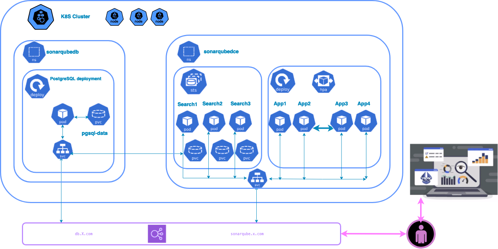

# Deploy SonarQube DCE on kubernetes cluster

## Introduction

In this tutorial, we will see how to deploy SonarQube DCE in a Kubernetes cluster using Helm with a customized values.yaml in an AWS EKS environment with three nodes and specific PVCs. We will use a PostgreSQL database instance within our Kubernetes cluster. We will start by understanding what Helm is.

 

- [**HELM Overviews**](helm.md): what Helm ?
- [**Deploy SonarQube DCE**](sqdce.md): 
