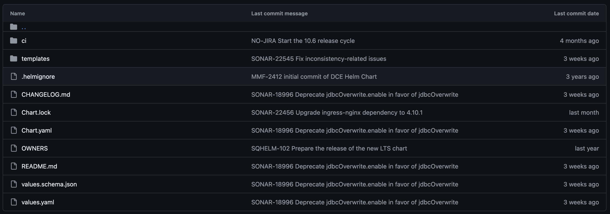
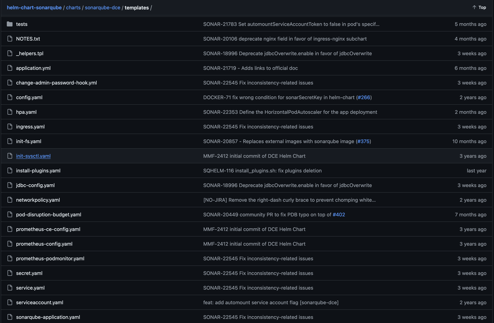

### ✅ What is HELM ?

Helm is a tool that automates the creation, packaging, configuration, and deployment of Kubernetes applications by combining your configuration files into a single reusable package.

In a microservice architecture, you create more microservices as the application grows, making it increasingly difficult to manage. Kubernetes, an open source container orchestration technology, simplifies the process by grouping multiple microservices into a single deployment. Yet managing Kubernetes applications across the development lifecycle brings its own set of challenges, including version management, resource allocation, updating, and rollbacks.

Helm provides one of the most accessible solutions to this problem, making deployments more consistent, repeatable, and reliable. In this article, you’ll learn about Helm and its use cases, as well as how to decide if you should adopt it for your Kubernetes projects.

### ✅ Helm charts

Helm chart is a package that contains all the necessary resources to deploy an application to a Kubernetes cluster. This includes YAML configuration files for deployments, services, secrets, and config maps that define the desired state of your application.

A Helm chart packages together YAML files and templates that can be used to generate additional configuration files based on parametrized values. This allows you to customize configuration files to suit different environments and to create reusable configurations for use across multiple deployments. Additionally, each Helm chart can be versioned and managed independently, making it easy to maintain multiple versions of an application with different configurations.

### ✅ Helm architecture

Helm’s architecture has two main components: client and library.

A Helm client is a command-line utility for end users to control local chart development and manage repositories and releases. 
The Helm library does all the heavy lifting. It contains the actual code to perform the operations specified in the Helm command. The combination of config and chart files to create any release is handled by the Helm library.

The Helm application library uses charts to define, create, install, and upgrade Kubernetes applications. Helm charts allow you to manage Kubernetes manifests without using the Kubernetes command-line interface (CLI) or remembering complicated Kubernetes commands to control the cluster.

HELM uses direct API communication to interact with the Kubernetes API server.

### ✅ The basic directory structure of a chart

he charts are grouped in the directories with the files under the following tree structure. This directory will be packaged in a versioned file ready to be deployed. The name of the folder is the name of the chart (without the version information). Therefore, a chart describing Memcached will be stored in the memcached/ directory.

In this directory, Helm will expect a structure that looks like this:

**📌  templates:** this directory contains the template files combined with the configuration values (from + values.yaml + and the command line) and rendered in the Kubernetes manifests. The templates use the Go programming language template format.

**📌 Charts:** optional, manually managed diagram dependencies can be placed in this directory, although it is generally best to use + Requirements.yaml + to dynamically link dependencies.

**📌 crds:**  optional, Kubernetes Custom Resource Definitions

**📌 Chart.yaml:**  a YAML file with metadata about the chart, such as chart name and version, maintainer information, relevant website, and search keywords.

**📌 README.md:**  a readme file containing information for the users of the chart.

**📌 LICENSE:**  a plain text license for the chart.

**📌 values.yaml:**  a YAML file containing the default configuration values of the chart.

**📌 File Chart.yaml:** 

This file contains many optional values such as the dependencies of this chart with other charts or the people who are in charge of the maintenance of the chart.

**📌 Templates folder:** 

Helm chart templates are written in the Go template language
All the template files are stored in this directory. When Helm processes charts, it passes all the files in this directory through the template creation engine.

---
<table>
<tr style="border: 0px transparent">
	<td style="border: 0px transparent"> <a href="README.md" title="Home">⬅ Previous</a></td><td style="border: 0px transparent"><a href="../README.md" title="home">🏠<a></td>
</tr>

</table>