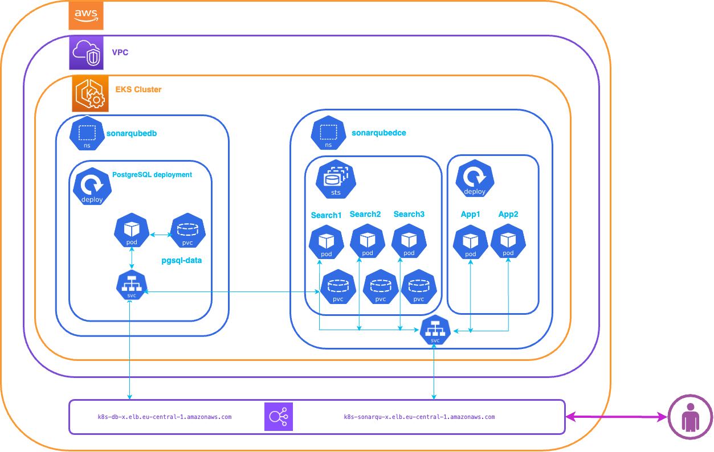

 


# Welcome to your SonarQube DCE Deployment 

The purpose of this deployment is to deploy SonarQube DCE in EKS Cluster with custom values.yaml. 



We will utilize the SonarQube DCE Helm chart.


## Prerequisites

Before you get started, you’ll need to have these things:

✅ An EKS Cluster runnig and configured

✅ Previous deployment steps are completed

## What does this task do?

- Create a k8s namespace for SonarQube DCE
- Deployment SonarQube DCE 


## Useful commands

 * `./cdk.sh deploy sonarqubedce`      deploy this stack 
 * `./cdk.sh destroy sonarqubedce`     cleaning up stack

  **sonarqubedce** is the deployment namespace,you have the freedom to use a namespace name that suits you.


## ✅ Setup Environment


▶️ Copy a template applicationnode-hpa.yaml in HELM chart template directory:

```bash
k8s-hpa-sonarqubedce:> cp charts/sonarqube-dce/templates/applicationnode-hpa.yaml helm-chart-sonarqube/charts/sonarqube-dce/templates/	
``` 

▶️ Buid HELM dependency:

```bash
k8s-hpa-sonarqubedce:> cd helm-chart-sonarqube/charts/sonarqube-dce
k8s-hpa-sonarqubedce:/helm-chart-sonarqube/charts/sonarqube-dce> helm dependency build
k8s-hpa-sonarqubedce:/helm-chart-sonarqube/charts/sonarqube-dce>cd ..
k8s-hpa-sonarqubedce:/helm-chart-sonarqube/charts>
``` 

We will use the following values.yaml file (k8s-hpa-sonarqubedce/charts/values.yaml):

```yaml
ApplicationNodes:
  replicaCount: 2
  autoscaling:
    enabled: true
    minReplicas: 2
    maxReplicas: 8
    targetCPUUtilizationPercentage: 50
  
service:
  type: LoadBalancer
  externalPort: 9000
  internalPort: 9000
  labels:
  annotations: 
   service.beta.kubernetes.io/aws-load-balancer-scheme: "internet-facing"
   service.beta.kubernetes.io/aws-load-balancer-type: nlb

postgresql:
  enabled: false  
  

jdbcOverwrite:
  enable: true
  jdbcPassword: Bench123
  jdbcUrl: "jdbc:postgresql://X.X.X.X/sonarqube"
  jdbcUsername: sonarqube

``` 


In the present 'values.yaml' file, numerous entries are available. We employ a load LoadBalancer service integrated with typical AWS annotations. 
If AWS EKS is not utilized, set the LoadBalancer Service with your respective values.
Please reference the inputs 'jdbcPassword', 'jdbcUrl', and 'jdbcUsername' with your respective values if you did not use the database deployment done in the previous step.

If using a kubernetes secret containing DB password not use **jdbcPassword** intput , you need to add these entries :
```yaml
jdbcSecretName: "sonarqube-jdbc"
jdbcSecretPasswordKey: "jdbc-password"
```

**jdbcSecretName** is a name of secret</br>
**jdbcSecretPasswordKey** is a key of password secret 

For populate a JDBCL URL you need a address of database service.
Run this command to get Cluster IPaddress or External IP address for database service. 
```bash
k8s-hpa-sonarqubedce:/helm-chart-sonarqube/charts> kubectl -n sonarqubedb get svc
NAME               TYPE           CLUSTER-IP      EXTERNAL-IP                                                                        PORT(S)          AGE
postgres-service   LoadBalancer   10.100.16.225   k8s-sonarqub-postgres-c24c80ab9f-0157658125734408.elb.eu-central-1.amazonaws.com   5432:30088/TCP   18h
k8s-hpa-sonarqubedce:/helm-chart-sonarqube/charts>
```
And replace a X.X.X.X values by your respective values.

▶️ Copy a values.yaml file in chart directory:
```bash
k8s-hpa-sonarqubedce:/helm-chart-sonarqube/charts> cp ../../charts/values.yaml .
k8s-hpa-sonarqubedce:/helm-chart-sonarqube/charts> cd ../../
k8s-hpa-sonarqubedce:>
``` 

## ✅ Deploying SonarQube

Let’s deploy a SonarQube! When you’re ready, run **./cdk.sh deploy sonarqubedce**

```bash
k8s-hpa-sonarqubedce:/sonarqube> ./cdk.sh deploy sonarqubedce
Deploying SonarQube DCE in namespace sonarqubedce...
Create Namespace sonarqubedce
namespace/sonarqubedce created
Namespace 'sonarqubedce' created.
Deploying SonarQube DCE HELM Chart
Release "sonarqubedce02" does not exist. Installing it now.
NAME: sonarqubedce02
LAST DEPLOYED: Wed Mar 20 12:50:52 2024
NAMESPACE: sonarqubedce
STATUS: deployed
REVISION: 1
NOTES:
1. Get the application URL by running these commands:
     NOTE: It may take a few minutes for the LoadBalancer IP to be available.
           You can watch the status of by running 'kubectl get svc -w sonarqubedce02-sonarqube-dce'
  export SERVICE_IP=$(kubectl get svc --namespace sonarqubedce1 sonarqubedce02-sonarqube-dce -o jsonpath='{.status.loadBalancer.ingress[0].ip}')
  echo http://$SERVICE_IP:9000
.....
.....
k8s-hpa-sonarqubedce:/sonarqube>
``` 

<br>
😀 &nbsp;&nbsp;Go to drink a cup of coffee....☕️ 
</br></br>
<p>ℹ️ &nbsp;&nbsp;In approximately 3 to 5 minutes, SonarQube  is deployed : <p>
  

You'll have to wait a few minutes for the External address to be bindered by DNS.

▶️ We can check if SonarQube is deployed and running :
```bash 
k8s-hpa-sonarqubedce:/sonarqube> kubectl get all -n sonarqubedce
NAME                                                    READY   STATUS    RESTARTS      AGE
pod/sonarqubedce02-sonarqube-dce-app-6f4bcbc87b-2xhr6   1/1     Running   4 (24m ago)   26m
pod/sonarqubedce02-sonarqube-dce-app-6f4bcbc87b-gq65w   1/1     Running   4 (24m ago)   26m
pod/sonarqubedce02-sonarqube-dce-search-0               1/1     Running   0             26m
pod/sonarqubedce02-sonarqube-dce-search-1               1/1     Running   0             25m
pod/sonarqubedce02-sonarqube-dce-search-2               1/1     Running   0             25m

NAME                                                   TYPE           CLUSTER-IP       EXTERNAL-IP                                                                        PORT(S)             AGE
service/sonarqubedce02-sonarqube-dce                   LoadBalancer   10.100.224.150   k8s-sonarqub-sonarqub-dfca344646-a3a1597b20396a90.elb.eu-central-1.amazonaws.com   9000:32297/TCP      26m
service/sonarqubedce02-sonarqube-dce-headless          ClusterIP      None             <none>                                                                             9003/TCP            26m
service/sonarqubedce02-sonarqube-dce-search            ClusterIP      10.100.164.208   <none>                                                                             9001/TCP,9002/TCP   26m
service/sonarqubedce02-sonarqube-dce-search-headless   ClusterIP      None             <none>                                                                             9001/TCP,9002/TCP   26m

NAME                                               READY   UP-TO-DATE   AVAILABLE   AGE
deployment.apps/sonarqubedce02-sonarqube-dce-app   2/2     2            2           26m

NAME                                                          DESIRED   CURRENT   READY   AGE
replicaset.apps/sonarqubedce02-sonarqube-dce-app-6f4bcbc87b   2         2         2       26m

NAME                                                   READY   AGE
statefulset.apps/sonarqubedce02-sonarqube-dce-search   3/3     26m

NAME                                                                                   REFERENCE                                     TARGETS   MINPODS   MAXPODS   REPLICAS   AGE
horizontalpodautoscaler.autoscaling/sonarqubedce02-sonarqube-dce-applicationnode-hpa   Deployment/sonarqubedce02-sonarqube-dce-app   7%/50%    2         8         2          26m
k8s-hpa-sonarqubedce:/sonarqube> 
``` 

-----
<table>
<tr style="border: 0px transparent">
	<td style="border: 0px transparent"> <a href="../db/README.md" title="PostgreSQL database">⬅ Previous</a></td><td style="border: 0px transparent"><a href="../README.md" title="home">🏠</a></td>
</tr>

</table>
