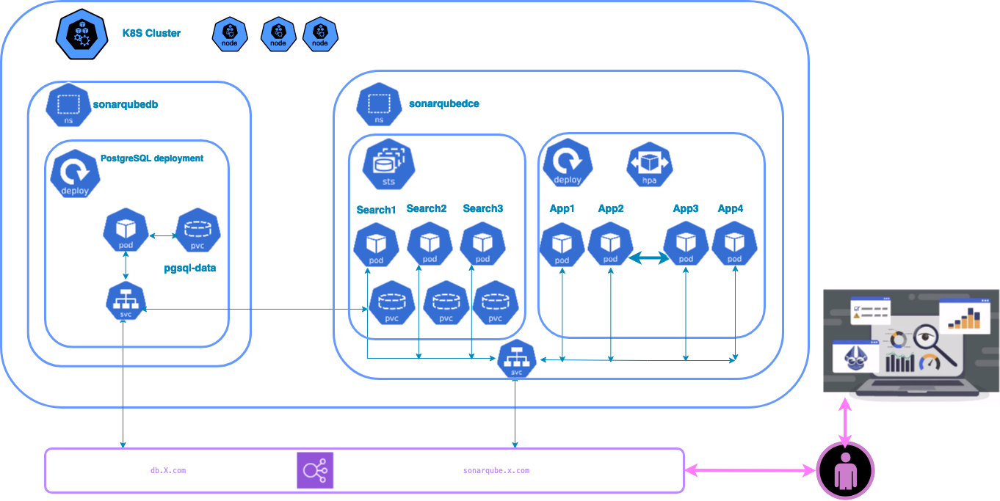

 

## Prerequisites

In this tutorial, we'll leverage an existing AWS EKS server for Kubernetes deployment. Additionally, we'll utilize AWS SDK in Go to provision a basic instance of PostgreSQL. However, it's not mandatory to follow this step if you already have your Kubernetes server deployed. We'll also provide scripts for deploying your own database instance, ensuring flexibility in your setup.

Why use the AWS SDK in go ? Because i already had a PostgreSQL deployment module used in another project, so I utilized it. We could have employed it to deploy the entire database and SonarQube DCE, but I wanted to demonstrate the addition of a Helm template.

If you have the prerequisites such as a Kubernetes server, a database instance, and Helm installed, you can skip directly to the SonarQube deployment section.

Before you get started, you’ll need to have these things:

* AWS account
* [AWS Development Kit (AWS SDK) v2](https://aws.github.io/aws-sdk-go-v2/docs/getting-started/)
* [Go language installed](https://go.dev/)
* [Kubectl installed](https://docs.aws.amazon.com/eks/latest/userguide/install-kubectl.html) is a command line tool that you use to communicate with the Kubernetes API 
server.
* [HELM](https://helm.sh/docs/intro/install/) The package manager for kubernetes
* bash version 4+
* A Git Client
* AWS EKS cluster installed


### ✅ Clone the repository

```bash
:> git clone https://github.com/SonarSource-Demos/Container_Architecture.git Container_Architecture
:> cd Container_Architecture/DCE
k8s-hpa-sonarqubedce/DCE:> 
```

### ✅ Database deployment
go to directory [db](db) (please read the README.md)

### ✅ SonarQube deployment
go to directory [sonarqube](sonarqube) (please read the README.md)