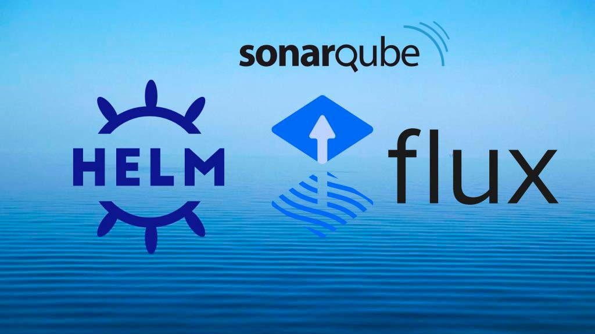

# Deploy SonarQube DCE on kubernetes cluster with FluxCD



## Introduction

FluxCD is an open-source tool that ensures that the state of a Kubernetes cluster matches the configuration stored in a Git repository. It automatically applies changes made to the repository to the cluster. FluxCD is a part of the CNCF incubating projects and it works through the use of custom resource definitions (CRDs), which extend Kubernetes APIs and offers additional features.

Using FluxCD to deploy SonarQube offers several advantages, especially within the context of DevOps and GitOps practices. Here are the key benefits:
1. Automation and Continuous Deployment

    GitOps: FluxCD is a GitOps tool that allows you to manage Kubernetes deployments directly from a Git repository. Any change in the repository (e.g., an update to the SonarQube configuration) is automatically synchronized with the Kubernetes cluster, ensuring continuous deployment.
    Reproducible Deployments: With FluxCD, every SonarQube deployment is traceable and reproducible from the source code, ensuring that the same environment is created every time.

2. Configuration Management and Security

    Versioning: SonarQube configurations (such as YAML files) are versioned in Git. This allows you to roll back to a previous version in case of issues while maintaining a full history of changes.
    Separation of Roles: With FluxCD, developers can submit changes via pull requests, and FluxCD takes care of applying these changes. This separates responsibilities and ensures quality control before deployment.

3. Monitoring and Observability

    Automatic Synchronization: FluxCD constantly monitors the state of resources in Kubernetes against the configuration in Git. If drift is detected (e.g., if SonarQube is manually modified), FluxCD automatically corrects it to revert to the desired state.
    Real-time Feedback: FluxCD can be configured to send notifications about deployment status (e.g., success or failure) via Slack, email, or other notification systems, providing continuous visibility into the state of SonarQube.

4. Flexibility and Scalability

    Multi-Tenant Environments: FluxCD can manage multiple environments (e.g., development, testing, production) with different configurations for SonarQube, making it easier to manage these environments in a shared Kubernetes cluster.
    Scalability: FluxCD allows you to easily manage the deployment of SonarQube in a scalable Kubernetes environment, automatically handling scaling or updating configurations.

5. Easy Integration with Other Tools

    CI/CD: FluxCD integrates easily with other CI/CD tools to automate the entire deployment pipeline for SonarQube.
    Helm Charts Support: If SonarQube is deployed via Helm Charts, FluxCD can manage the versions and updates of the charts, simplifying dependency and configuration management.

In summary, using FluxCD to deploy SonarQube provides automated, secure, and scalable deployment management, while integrating GitOps best practices for simplified Kubernetes infrastructure management.


## Prerequisites

Before you get started, you’ll need to have these things:

✅ An EKS Cluster runnig and configured

✅ helm installed

✅ Kubernetes CLI (kubectl)

✅ A GitHub account (in our example), but Flux supports Git repos: AWS CodeCommit ,Azure DevOps Bitbucket Server and Data Center GitHub.com and GitHub Enterprise GitLab.com and GitLab Enterprise.

✅ A PAT ([Personal Access Token on GitHub](https://docs.github.com/en/authentication/keeping-your-account-and-data-secure/managing-your-personal-access-tokens) with all permissions under repo and workflow)


## What does this task do?

- Create a k8s namespace for SonarQube DCE
- Deployment SonarQube DCE with Flux
- Upgrade SonarQube DCE with Flux

The scenario we will use is as follows: we will install SonarQube DCE version 10.5.1 and then perform an upgrade to version 10.6.0.


## Installation

🟢 The step 1 is to install the Flux CLI
The Flux CLI is available as a binary executable for all major platforms, the binaries can be downloaded from [GitHub releases page](https://github.com/fluxcd/flux2/releases).

With Homebrew for macOS and Linux:
```bash 
:> brew install fluxcd/tap/flux
```
🟢 The step 2 we will create a github repository: **flux-sonarqube** which will contain our flux configuration files for deployment.

Create the GitHub repository via the command line using curl :
```bash 
:> curl -u "GITHUB_USERNAME:PAT" https://api.github.com/user/repos -d '{"name":"flux-sonarqube"}'

```
Replace **GITHUB_USERNAME** with your GitHub username, **PAT** with your personal access token, **flux-sonarqube** is an example you can replace it with the desired name for your repository.

Initialize a Git repository locally and link it to your new GitHub repository:
```bash 
:> mkdir flux-sonarqube
cd flux-sonarqube
git init
git remote add origin https://github.com/GITHUB_USERNAME/flux-sonarqube.git

```

🟢 The step 3 : Install FluxCD with GitHub bootstrap

Use the flux bootstrap github command to initialize FluxCD in your cluster and configure the GitHub repository to manage your infrastructure:

```bash 
:> export GITHUB_TOKEN=<your-token>
:>
:> flux bootstrap github \
  --owner=GITHUB_USERNAME \
  --repository=flux-sonarqube \
  --branch=main \
  --path=clusters/my-cluster \
  --personal \
  --token-auth \
  --personal


► connecting to github.com
► cloning branch "main" from Git repository "https://github.com/XXXX/flux-sonarqube.git"
✔ cloned repository
► generating component manifests
✔ generated component manifests
✔ committed component manifests to "main" ("9ebfe1521b300e0dcabb29b54d87f10d8fef24db")
► pushing component manifests to "https://github.com/XXXX/flux-sonarqube.git"
► installing components in "flux-system" namespace
✔ installed components
✔ reconciled components
► determining if source secret "flux-system/flux-system" exists
► generating source secret
► applying source secret "flux-system/flux-system"
✔ reconciled source secret
► generating sync manifests
✔ generated sync manifests
✔ committed sync manifests to "main" ("4ac7e17f9d7be860b2670fc57a02cf0a1b0bfe58")
► pushing sync manifests to "https://github.com/XXX/flux-sonarqube.git"
► applying sync manifests
✔ reconciled sync configuration
◎ waiting for GitRepository "flux-system/flux-system" to be reconciled
✔ GitRepository reconciled successfully
◎ waiting for Kustomization "flux-system/flux-system" to be reconciled
✔ Kustomization reconciled successfully
► confirming components are healthy
✔ helm-controller: deployment ready
✔ kustomize-controller: deployment ready
✔ notification-controller: deployment ready
✔ source-controller: deployment ready
✔ all components are healthy
```
**--token-auth** is used to authenticate with the PAT.

**--personal** indicates that you are using a personal repository (under your name) and not an enterprise one. If you are using an enterprise repository, you can remove this option.

Replace **GITHUB_USERNAME** with your GitHub username, **your-token** with your personal access token, **my-cluster** with your cluster name .
**flux-sonarqube** is an example you can replace it with the desired name for your repository.

Check Installation :

The installation created a flux-system namespace. To verify if Flux is properly deployed, run the following command:

```bash 
:> kubectl -n flux-system get all
NAME                                           READY   STATUS    RESTARTS   AGE
pod/helm-controller-76dff45854-lgfnz           1/1     Running   0          8m55s
pod/kustomize-controller-6bc5d5b96-wjrt4       1/1     Running   0          8m55s
pod/notification-controller-7f5cd7fdb8-2btn6   1/1     Running   0          8m55s
pod/source-controller-54c89dcbf6-fswd5         1/1     Running   0          8m54s

NAME                              TYPE        CLUSTER-IP       EXTERNAL-IP   PORT(S)   AGE
service/notification-controller   ClusterIP   10.100.145.8     <none>        80/TCP    8m55s
service/source-controller         ClusterIP   10.100.194.232   <none>        80/TCP    8m55s
service/webhook-receiver          ClusterIP   10.100.33.74     <none>        80/TCP    8m55s

NAME                                      READY   UP-TO-DATE   AVAILABLE   AGE
deployment.apps/helm-controller           1/1     1            1           8m55s
deployment.apps/kustomize-controller      1/1     1            1           8m55s
deployment.apps/notification-controller   1/1     1            1           8m55s
deployment.apps/source-controller         1/1     1            1           8m55s

NAME                                                 DESIRED   CURRENT   READY   AGE
replicaset.apps/helm-controller-76dff45854           1         1         1       8m55s
replicaset.apps/kustomize-controller-6bc5d5b96       1         1         1       8m55s
replicaset.apps/notification-controller-7f5cd7fdb8   1         1         1       8m55s
replicaset.apps/source-controller-54c89dcbf6         1         1         1       8m55s
```