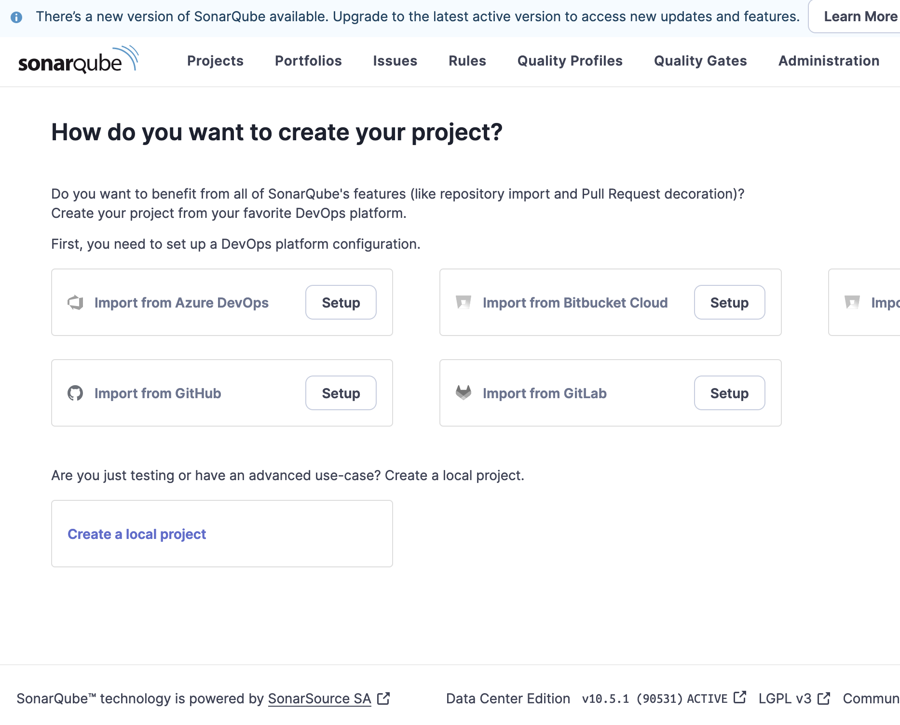

# Deploy SonarQube DCE on kubernetes cluster with FluxCD Part1


## Introduction

FluxCD is an open-source tool that ensures that the state of a Kubernetes cluster matches the configuration stored in a Git repository. It automatically applies changes made to the repository to the cluster. FluxCD is a part of the CNCF incubating projects and it works through the use of custom resource definitions (CRDs), which extend Kubernetes APIs and offers additional features.

Using FluxCD to deploy SonarQube offers several advantages, especially within the context of DevOps and GitOps practices. Here are the key benefits:
1. Automation and Continuous Deployment

    GitOps: FluxCD is a GitOps tool that allows you to manage Kubernetes deployments directly from a Git repository. Any change in the repository (e.g., an update to the SonarQube configuration) is automatically synchronized with the Kubernetes cluster, ensuring continuous deployment.
    Reproducible Deployments: With FluxCD, every SonarQube deployment is traceable and reproducible from the source code, ensuring that the same environment is created every time.

2. Configuration Management and Security

    Versioning: SonarQube configurations (such as YAML files) are versioned in Git. This allows you to roll back to a previous version in case of issues while maintaining a full history of changes.
    Separation of Roles: With FluxCD, developers can submit changes via pull requests, and FluxCD takes care of applying these changes. This separates responsibilities and ensures quality control before deployment.

3. Monitoring and Observability

    Automatic Synchronization: FluxCD constantly monitors the state of resources in Kubernetes against the configuration in Git. If drift is detected (e.g., if SonarQube is manually modified), FluxCD automatically corrects it to revert to the desired state.
    Real-time Feedback: FluxCD can be configured to send notifications about deployment status (e.g., success or failure) via Slack, email, or other notification systems, providing continuous visibility into the state of SonarQube.

4. Flexibility and Scalability

    Multi-Tenant Environments: FluxCD can manage multiple environments (e.g., development, testing, production) with different configurations for SonarQube, making it easier to manage these environments in a shared Kubernetes cluster.
    Scalability: FluxCD allows you to easily manage the deployment of SonarQube in a scalable Kubernetes environment, automatically handling scaling or updating configurations.

5. Easy Integration with Other Tools

    CI/CD: FluxCD integrates easily with other CI/CD tools to automate the entire deployment pipeline for SonarQube.
    Helm Charts Support: If SonarQube is deployed via Helm Charts, FluxCD can manage the versions and updates of the charts, simplifying dependency and configuration management.

In summary, using FluxCD to deploy SonarQube provides automated, secure, and scalable deployment management, while integrating GitOps best practices for simplified Kubernetes infrastructure management.


## Prerequisites

Before you get started, you’ll need to have these things:

✅ An EKS Cluster runnig and configured

✅ helm installed

✅ Kubernetes CLI (kubectl)

✅ A GitHub account (in our example), but Flux supports Git repos: AWS CodeCommit ,Azure DevOps Bitbucket Server and Data Center GitHub.com and GitHub Enterprise GitLab.com and GitLab Enterprise.

✅ A PAT ([Personal Access Token on GitHub](https://docs.github.com/en/authentication/keeping-your-account-and-data-secure/managing-your-personal-access-tokens) with all permissions under repo and workflow)


## What does this task do?

- Create a k8s namespace for SonarQube DCE
- Deployment SonarQube DCE with Flux
- Upgrade SonarQube DCE with Flux

The scenario we will use is as follows: we will install SonarQube DCE version 10.5.1 and then perform an upgrade to version 10.6.0.


## Installation

🟢 The step 1 is to install the Flux CLI
The Flux CLI is available as a binary executable for all major platforms, the binaries can be downloaded from [GitHub releases page](https://github.com/fluxcd/flux2/releases).

With Homebrew for macOS and Linux:
```bash 
:> brew install fluxcd/tap/flux
```
🟢 The step 2 we will create a github repository: **flux-sonarqube** which will contain our flux configuration files for deployment.

Create the GitHub repository via the command line using curl :
```bash 
:> curl -u "GITHUB_USERNAME:PAT" https://api.github.com/user/repos -d '{"name":"flux-sonarqube"}'

```
Replace **GITHUB_USERNAME** with your GitHub username, **PAT** with your personal access token, **flux-sonarqube** is an example you can replace it with the desired name for your repository.

Initialize a Git repository locally and link it to your new GitHub repository:
```bash 
:> mkdir flux-sonarqube
cd flux-sonarqube
git init
git remote add origin https://github.com/GITHUB_USERNAME/flux-sonarqube.git

```

🟢 The step 3 : Install FluxCD with GitHub bootstrap

Use the flux bootstrap github command to initialize FluxCD in your cluster and configure the GitHub repository to manage your infrastructure:

```bash 
:> export GITHUB_TOKEN=<your-token>
:>
:> flux bootstrap github \
  --owner=GITHUB_USERNAME \
  --repository=flux-sonarqube \
  --branch=main \
  --path=clusters/my-cluster \
  --personal \
  --token-auth \
  --personal


► connecting to github.com
► cloning branch "main" from Git repository "https://github.com/XXXX/flux-sonarqube.git"
✔ cloned repository
► generating component manifests
✔ generated component manifests
✔ committed component manifests to "main" ("9ebfe1521b300e0dcabb29b54d87f10d8fef24db")
► pushing component manifests to "https://github.com/XXXX/flux-sonarqube.git"
► installing components in "flux-system" namespace
✔ installed components
✔ reconciled components
► determining if source secret "flux-system/flux-system" exists
► generating source secret
► applying source secret "flux-system/flux-system"
✔ reconciled source secret
► generating sync manifests
✔ generated sync manifests
✔ committed sync manifests to "main" ("4ac7e17f9d7be860b2670fc57a02cf0a1b0bfe58")
► pushing sync manifests to "https://github.com/XXX/flux-sonarqube.git"
► applying sync manifests
✔ reconciled sync configuration
◎ waiting for GitRepository "flux-system/flux-system" to be reconciled
✔ GitRepository reconciled successfully
◎ waiting for Kustomization "flux-system/flux-system" to be reconciled
✔ Kustomization reconciled successfully
► confirming components are healthy
✔ helm-controller: deployment ready
✔ kustomize-controller: deployment ready
✔ notification-controller: deployment ready
✔ source-controller: deployment ready
✔ all components are healthy
```
**--token-auth** is used to authenticate with the PAT.

**--personal** indicates that you are using a personal repository (under your name) and not an enterprise one. If you are using an enterprise repository, you can remove this option.

Replace **GITHUB_USERNAME** with your GitHub username, **your-token** with your personal access token, **my-cluster** with your cluster name .
**flux-sonarqube** is an example you can replace it with the desired name for your repository.

Check Installation :

The installation created a flux-system namespace. To verify if Flux is properly deployed, run the following command:

```bash 
:> kubectl -n flux-system get all
NAME                                           READY   STATUS    RESTARTS   AGE
pod/helm-controller-76dff45854-lgfnz           1/1     Running   0          8m55s
pod/kustomize-controller-6bc5d5b96-wjrt4       1/1     Running   0          8m55s
pod/notification-controller-7f5cd7fdb8-2btn6   1/1     Running   0          8m55s
pod/source-controller-54c89dcbf6-fswd5         1/1     Running   0          8m54s

NAME                              TYPE        CLUSTER-IP       EXTERNAL-IP   PORT(S)   AGE
service/notification-controller   ClusterIP   10.100.145.8     <none>        80/TCP    8m55s
service/source-controller         ClusterIP   10.100.194.232   <none>        80/TCP    8m55s
service/webhook-receiver          ClusterIP   10.100.33.74     <none>        80/TCP    8m55s

NAME                                      READY   UP-TO-DATE   AVAILABLE   AGE
deployment.apps/helm-controller           1/1     1            1           8m55s
deployment.apps/kustomize-controller      1/1     1            1           8m55s
deployment.apps/notification-controller   1/1     1            1           8m55s
deployment.apps/source-controller         1/1     1            1           8m55s

NAME                                                 DESIRED   CURRENT   READY   AGE
replicaset.apps/helm-controller-76dff45854           1         1         1       8m55s
replicaset.apps/kustomize-controller-6bc5d5b96       1         1         1       8m55s
replicaset.apps/notification-controller-7f5cd7fdb8   1         1         1       8m55s
replicaset.apps/source-controller-54c89dcbf6         1         1         1       8m55s
```

## Configuration

🟢 Step 1: Add configurations for SonarQube

We will create a directory **clusters/NAME_OF_YOUR_CLUSTER** (in our repository ) which will contain the necessary configuration files.
```bash 
:flux-sonarqube> mkdir -p clusters/ClustWorkshop03
:flux-sonarqube> 
```


We will create a **charts** directory (in our repository) that will contain a YAML file for the definition of the Helm repository for SonarQube.

```bash 
:flux-sonarqube> mkdir -p clusters/ClustWorkshop03/charts
:flux-sonarqube> cd clusters/ClustWorkshop03/charts
:flux-sonarqube/clusters/ClustWorkshop03/charts> 
```

In our example, the file is named **helm-repository.yaml**, and the content is as follows:
```yaml
apiVersion: source.toolkit.fluxcd.io/v1
kind: HelmRepository
metadata:
  name: sonarqube-repo
  namespace: flux-system
spec:
  interval: 1m
  url: https://SonarSource.github.io/helm-chart-sonarqube
```

We will also create a release directory (in our repository ) that will contain a YAML file for the Helm release. This file will include all the deployment options for SonarQube, as defined in the [values.yaml](https://github.com/SonarSource/helm-chart-sonarqube/blob/master/charts/sonarqube-dce/values.yaml) of the SonarQube Helm chart.

```bash 
:flux-sonarqube> mkdir -p clusters/ClustWorkshop03/release
:flux-sonarqube> cd clusters/ClustWorkshop03/release
:flux-sonarqube/clusters/ClustWorkshop03/release> 
```
In our example, the file is named **helm-repository.yaml**, and the content is as follows:

```yaml
apiVersion: helm.toolkit.fluxcd.io/v2
kind: HelmRelease
metadata:
  name: sonarqube-dce
  namespace: sqdce  # namespace SonarQube deployment
spec:
  interval: 20m
  driftDetection:
    mode: enabled
  timeout: 20m # match startup probe defined below
  chart:
    spec:
      chart: sonarqube-dce
      version: "10.5.1+2816" #  SonarQube chart version
      sourceRef:
        kind: HelmRepository 
        name: sonarqube-repo   # Reference on HelmRepository created with helm-repository.yaml file
        namespace: flux-system
  upgrade:
    remediation:
      remediateLastFailure: true
  values:
    service:
      type: LoadBalancer
      externalPort: 9000
      internalPort: 9000
      annotations:
        service.beta.kubernetes.io/aws-load-balancer-scheme: "internet-facing"
        service.beta.kubernetes.io/aws-load-balancer-type: nlb
    postgresql:
      image:
        tag: 11.22.0-debian-11-r4
    searchNodes:
      # Pod Disruption Budget for search nodes
      podDisruptionBudget:
        minAvailable: 2
      persistence:
        enabled: true
    ApplicationNodes:
      
      # SQ takes a looong time to come live...
      # Give it 20 min (60 sec delay, 1140 sec probing) to come live
      startupProbe:
        initialDelaySeconds: 60
        periodSeconds: 10
        failureThreshold: 114
      # Start probing readiness and liveness immediately after successful startup
      # If SQ is unhealthy for more than 10 min, don't route traffic to it and restart it
      readinessProbe:
        initialDelaySeconds: 0
        periodSeconds: 30
        failureThreshold: 20
      livenessProbe:
        initialDelaySeconds: 0
        periodSeconds: 30
        failureThreshold: 20
      existingJwtSecret: sonarqube-dce-auth-jwt
    serviceAccount:
      create: true
    logging:
      jsonOutput: true
    sonarProperties:
      sonar.forceAuthentication: true
      sonar.updatecenter.activate: false # Disable update center, plugins are managed via Helm chart values and pinned to specific version
      # Log level
      sonar.log.level: INFO
```

❗️ In this deployment, we are not using an external database, this is just to simplify the example. If you want to use an external database or a pre-existing instance in your cluster, you will need to set:
```yaml
postgresql: 
  enabled: false
```
and reference the JDBC configuration as indicated in the [values.yaml](https://github.com/SonarSource/helm-chart-sonarqube/blob/master/charts/sonarqube-dce/values.yaml).Example :

```yaml

 jdbcOverwrite:
      enable: true
      # The JDBC url of the external DB
      jdbcUrl: ${jdbc_url} # has to be changed according to environment
      # The DB user that should be used for the JDBC connection
      jdbcUsername: postgres
      # Use pre-existing k8s secret containing the DB password
      jdbcSecretName: sonarqube-dce-db-credentials-es
      # and the secretValueKey of the password found within that secret
      jdbcSecretPasswordKey: sonarqube_dce_db_instance_password
```
❗️ For PostgreSQL, we specified the version because if you have an ARM-based Kubernetes cluster, the default version deployed by the SonarQube Helm chart does not support ARM architecture.

❗️ In this deployment, I am using a load balancer, and the settings are specific to an AWS environment.We have created a secret to store the application authentication JWT token.

❗️ To determine the chart version of the SonarQube , you need to run the following command:

```bash 
:flux-sonarqube>  helm search repo sonarqube/sonarqube-dce --versions
NAME                    CHART VERSION   APP VERSION     DESCRIPTION                                       
sonarqube/sonarqube-dce 10.6.0+3033     10.6.0          SonarQube is a self-managed, automatic code rev...
sonarqube/sonarqube-dce 10.5.1+2816     10.5.1          SonarQube is a self-managed, automatic code rev...
sonarqube/sonarqube-dce 10.5.0+2748     10.5.0          SonarQube is a self-managed, automatic code rev...
....
flux-sonarqube>
```
❗️ Of course, before running this command, you need to have added the Helm repository to your Helm registry.
```bash 
flux-sonarqube> helm repo add sonarqube https://SonarSource.github.io/helm-chart-sonarqube
flux-sonarqube> helm repo update
flux-sonarqube>
```

The structure of your repository is as follows :

```bash 
clusters/
└── ClustWorkshop03/
    ├── charts/
    │   └── helm-repository.yaml
    │   
    └── releases/
        └── sonarqube-dce.yaml
```

🟢 Step 2: Prepare the environment to deploy sonarqube

Created a namespace :

```bash 
:flux-sonarqube> kubectl create ns sqdce
namespace/sqdce created
flux-sonarqube>
```
Created a secret to store the application authentication JWT token :

```bash 
:flux-sonarqube> export JWT_SECRET=$(echo -n "your_secret" | openssl dgst -sha256 -hmac "your_key" -binary | base64)
:flux-sonarqube> kubectl -n sqdce create secret generic sonarqube-dce-auth-jwt --from-literal=SONAR_AUTH_JWTBASE64HS256SECRET=${JWT_SECRET}
secret/sonarqube-dce-auth-jwt created
:flux-sonarqube>
```

##  Deploying SonarQube


Add the files to the Git repository and push them to GitHub:

```bash 
:flux-sonarqube> git add *
:flux-sonarqube> git commit -m "Add SonarQube Helm configurations"
main 234de7b] Add SonarQube Helm configurations
:flux-sonarqube> git push
:flux-sonarqube>
```

After pushing the configurations to GitHub, FluxCD will detect the changes and apply the configurations to your Kubernetes cluster, thus deploying SonarQube.😀

Let's check if the deployment is in progress :

```bash 
:flux-sonarqube> kubectl get helmrelease sonarqube-dce -n sqdce
NAME            AGE   READY     STATUS
sonarqube-dce   38s   Unknown   Running 'install' action with timeout of 20m0s
:flux-sonarqube>
```
The deployment is in progress, after a few minutes the deployment is operational

```bash 
:flux-sonarqube> kubectl get helmrelease sonarqube-dce -n sqdce
NAME            AGE     READY   STATUS
sonarqube-dce   6m53s   True    Helm install succeeded for release sqdce/sonarqube-dce.v1 with chart sonarqube-dce@10.5.1+2816
:flux-sonarqube>
```
Sonarqube version 10.5.1 is well deployed and operational from Flux.

We can check if SonarQube is deployed :
```bash 
:flux-sonarqube> kubectl -n sqdce get pods
NAME                                               READY   STATUS    RESTARTS      AGE
sonarqube-dce-postgresql-0                         1/1     Running   0             6m
sonarqube-dce-sonarqube-dce-app-599595fcf5-n6kzf   1/1     Running   4 (5m ago)    5m
sonarqube-dce-sonarqube-dce-app-599595fcf5-txtnw   1/1     Running   4 (5m ago)    5m
sonarqube-dce-sonarqube-dce-search-0               1/1     Running   0             5m
sonarqube-dce-sonarqube-dce-search-1               1/1     Running   0             5m
sonarqube-dce-sonarqube-dce-search-2               1/1     Running   0             5m
:flux-sonarqube>
```
We can check if SonarQube service running :
```bash 
:flux-sonarqube> kubectl -n sqdce get svc sonarqube-dce-sonarqube-dce

NAME                          TYPE           CLUSTER-IP      EXTERNAL-IP                   PORT(S)      AGE
sonarqube-dce-sonarqube-dce   LoadBalancer   10.X.X.X    k8s-sqdce-sonarqub-xxxx.com   9000:31935/TCP   111m
:flux-sonarqube>
```
😀 Now you can connect to the SonarQube instance at the following url sample:

http://k8s-sonarqub-xxxx.com:9000



----
## Troubleshooting

✳️ Check resource status:

Run the following commands to check the status of resources in the flux-system and sqdce namespace
```bash 
:flux-sonarqube>  kubectl get helmrepositories -n flux-system
NAME             URL                                                  AGE    READY   STATUS
sonarqube-repo   https://SonarSource.github.io/helm-chart-sonarqube   155m   True    stored artifact: revision 'sha256:7c9e87e89ef02e31c64358103d6379871f3a55faf64c852102b36dfad18b98ac'
:flux-sonarqube> 
:flux-sonarqube> kubectl get helmreleases -n sqdce      
NAME            AGE    READY   STATUS
sonarqube-dce   148m   True    Helm install succeeded for release sqdce/sonarqube-dce.v1 with chart sonarqube-dce@10.5.1+2816
```

✳️ Show flux warning events
```bash 
:flux-sonarqube> kubectl get events -n flux-system --field-selector type=Warning
```

✳️ Show all Flux objects (check for Ready=True and Suspend=False)
```bash 
:flux-sonarqube> flux get sources all -A
```

✳️ Check GitOps Source Status
```bash 
:flux-sonarqube> flux check
```

✳️ Check HelmController logs
```bash 
:flux-sonarqube> kubectl logs -n flux-system deploy/helm-controller
```

✳️ Force synchronization
```bash 
:flux-sonarqube> flux reconcile kustomization flux-system -n flux-system
```

✳️ Use the following command to see the details of your Kustomization :
```bash 
:flux-sonarqube> kubectl describe kustomization flux-system -n flux-system
```
✳️ Check a status of kustomizations
```bash 
:flux-sonarqube> kubectl get kustomizations -n flux-system
```

----
✅ Ressources

🏠 [SonarQube HELM](https://github.com/SonarSource/helm-chart-sonarqube/tree/master/charts)

🏠 [Fluxcd](https://v2-0.docs.fluxcd.io/flux/installation/)

🏠 [Flux CLI](https://v2-0.docs.fluxcd.io/flux/cmd/)

🏠 [Troubleshooting](https://fluxcd.io/flux/cheatsheets/troubleshooting/)

 📌 You will find the YAML files used for this deployment in the **manifests** directory.


-----
<table>
<tr style="border: 0px transparent">
    <td style="border: 0px transparent"> <a href="../README.md" title="home">⬅ Previous</a></td><td style="border: 0px transparent"><a href="upgrade.md" title="Upgrade SonarQube DCE with FluxCD part 2">Next ➡</a></td><td style="border: 0px transparent"><a href="../README.md" title="home">🏠</a></td>
</tr>

</table>
