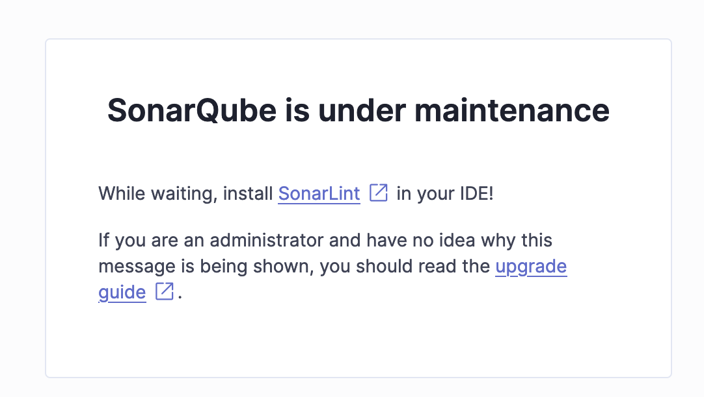
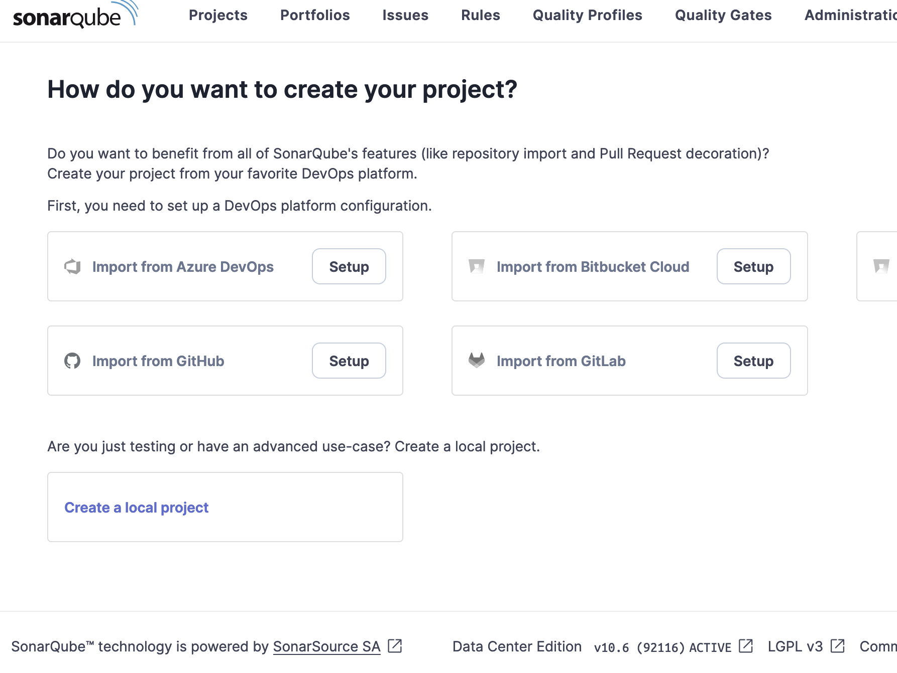

# Deploy SonarQube DCE on kubernetes cluster with FluxCD Part2


## Introduction

In this repository, we will go through the steps to upgrade our SonarQube DCE instance using FluxCD.
We are going to upgrade our SonarQube DCE version 10.5.1 to version 10.6.0

## Prerequisites

✅ Having completed [Part 1](README.md)

## Upgrade SonarQube DCE

 📌 Step 1 : Update a local flux repository

 ❗️Before making any changes, you must update your local repository because Flux updates state files in the directory **cluster/NAME_OF_YOUR_CLUSTER/flux-system**.

 ```bash 
:flux-sonarqube> git pull
```

📌 Step 2 : Update your Helm release file (cluster/NAME_OF_YOUR_CLUSTER/release/donarqube-dce.yaml)

 We are going to modify the HELM chart version value.
 🤔 Do you remember the command to get the HELM chart version for SonarQube 10.6.0? 
 The command is :

 ```bash 
:flux-sonarqube> helm search repo sonarqube/sonarqube-dce --versions
NAME                    CHART VERSION   APP VERSION     DESCRIPTION                                       
sonarqube/sonarqube-dce 10.6.0+3033     10.6.0          SonarQube is a self-managed, automatic code rev...
sonarqube/sonarqube-dce 10.5.1+2816     10.5.1          SonarQube is a self-managed, automatic code rev...
sonarqube/sonarqube-dce 10.5.0+2748     10.5.0          SonarQube is a self-managed, automatic code rev...
```

The version number will be : **10.6.0+3033** . So replace the value **10.5.1+2816** with **10.6.0+3033**

 **helm-repository.yaml** file the content is as follows:

```yaml
apiVersion: helm.toolkit.fluxcd.io/v2
kind: HelmRelease
metadata:
  name: sonarqube-dce
  namespace: sqdce  # namespace SonarQube deployment
spec:
  interval: 20m
  driftDetection:
    mode: enabled
  timeout: 20m # match startup probe defined below
  chart:
    spec:
      chart: sonarqube-dce
      version: "10.6.0+3033" #  SonarQube chart version
      sourceRef:
        kind: HelmRepository 
        name: sonarqube-repo   # Reference on HelmRepository created with helm-repository.yaml file
        namespace: flux-system
  upgrade:
    remediation:
      remediateLastFailure: true
  values:
    service:
      type: LoadBalancer
      externalPort: 9000
      internalPort: 9000
      annotations:
        service.beta.kubernetes.io/aws-load-balancer-scheme: "internet-facing"
        service.beta.kubernetes.io/aws-load-balancer-type: nlb
    postgresql:
      image:
        tag: 11.22.0-debian-11-r4
    searchNodes:
      # Pod Disruption Budget for search nodes
      podDisruptionBudget:
        minAvailable: 2
      persistence:
        enabled: true
    ApplicationNodes:
      
      # SQ takes a looong time to come live...
      # Give it 20 min (60 sec delay, 1140 sec probing) to come live
      startupProbe:
        initialDelaySeconds: 60
        periodSeconds: 10
        failureThreshold: 114
      # Start probing readiness and liveness immediately after successful startup
      # If SQ is unhealthy for more than 10 min, don't route traffic to it and restart it
      readinessProbe:
        initialDelaySeconds: 0
        periodSeconds: 30
        failureThreshold: 20
      livenessProbe:
        initialDelaySeconds: 0
        periodSeconds: 30
        failureThreshold: 20
      existingJwtSecret: sonarqube-dce-auth-jwt
    serviceAccount:
      create: true
    logging:
      jsonOutput: true
    sonarProperties:
      sonar.forceAuthentication: true
      sonar.updatecenter.activate: false # Disable update center, plugins are managed via Helm chart values and pinned to specific version
      # Log level
      sonar.log.level: INFO
```

📌 Step 3 : Update the FluxCD configuration.

You need to commit the changes to your FluxCD repository.

```bash 
:flux-sonarqube> git add *
:flux-sonarqube> git commit -m "Upgrade SonarQube 10.6.0"
[main 8e094cd] update 10.6.0+3033
:flux-sonarqube> git push
:flux-sonarqube>
```

After pushing the configurations to GitHub, FluxCD will detect the changes and apply the configurations to your Kubernetes cluster, thus deploying SonarQube.😀

Let's check if the deployment is in progress :

```bash 
:flux-sonarqube> kubectl get helmrelease sonarqube-dce -n sqdce
NAME            AGE   READY     STATUS
sonarqube-dce   29s   Unknown   Running 'upgrade' action with timeout of 20m0s
:flux-sonarqube>
```

The deployment is in progress, after a few minutes the deployment is operational

```bash 
:flux-sonarqube> kubectl get helmrelease sonarqube-dce -n sqdce
NAME            AGE     READY   STATUS
sonarqube-dce   3m53s   True   Helm upgrade succeeded for release sqdce/sonarqube-dce.v2 with chart sonarqube-dce@10.6.0+3033
:flux-sonarqube>
```

We can confirm that the deployed version is indeed 10.6.0+3033.😀


📌 Step 4 : Upgrade a SonarQube database.



You need to execute this URL in your browser (use the SonarQube service connection URL).

http://k8s-sonarqub-xxxx.com:9000/setup

🤔 If you don't remember the SonarQube connection URL, the command to retrieve it is:
```bash 
:flux-sonarqube> kubectl -n sqdce get svc sonarqube-dce-sonarqube-dce

NAME                          TYPE           CLUSTER-IP      EXTERNAL-IP                   PORT(S)      AGE
sonarqube-dce-sonarqube-dce   LoadBalancer   10.X.X.X    k8s-sqdce-sonarqub-xxxx.com   9000:31935/TCP   111m
:flux-sonarqube>
```

 After a few minutes you can connect to the SonarQube instance 😀



-----

✅ Clean Up resources

For clean up platform please run this command :
```bash 
:flux-sonarqube> flux uninstall --namespace=flux-system
```

----

## Conclusion

As you can see, it is quite straightforward to configure and use FluxCD to deploy and upgrade SonarQube.In conclusion, adopting FluxCD with the Helm provider for SonarQube deployment not only enhances the CI/CD process but also helps maintain high code quality across customers projects.


-----
<table>
<tr style="border: 0px transparent">
    <td style="border: 0px transparent"> <a href="README.md" title="Upgrade SonarQube DCE with FluxCD part 1">⬅ Previous</a></td><td style="border: 0px transparent"><a href="../README.md" title="home">🏠</a></td>
</tr>

</table>