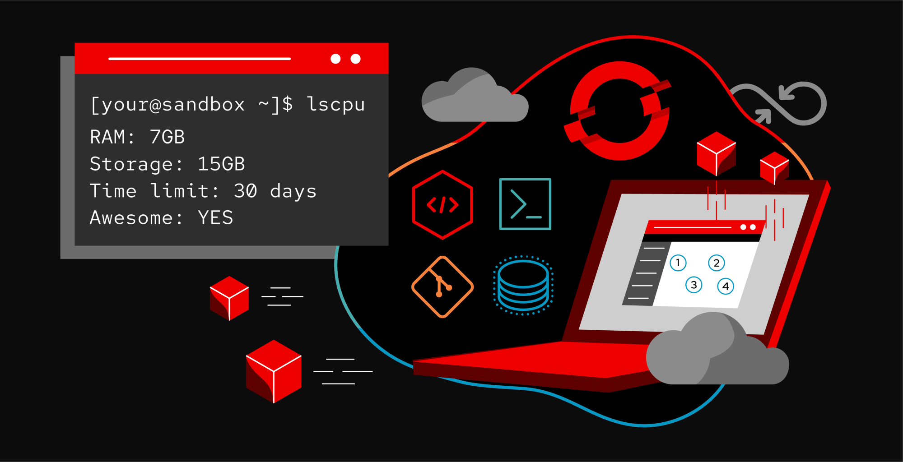
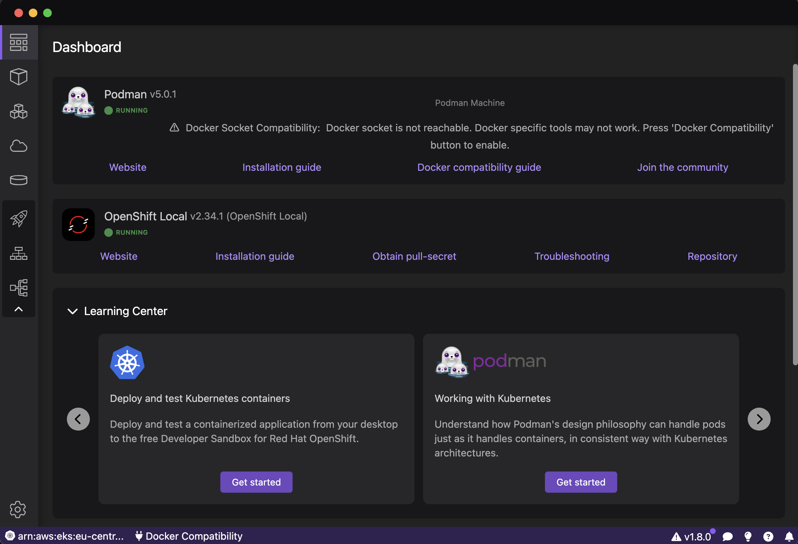
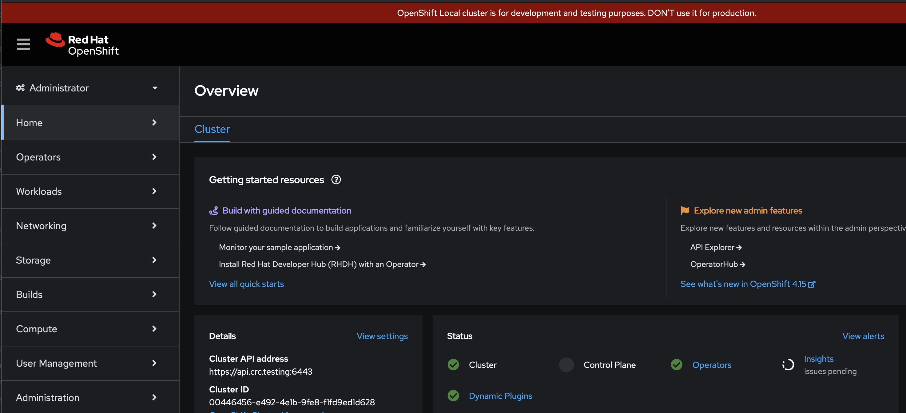
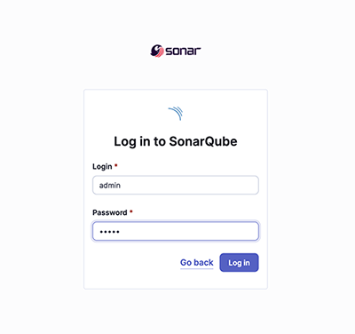

 

## Introduction

Red Hat OpenShift Container Platform is an enterprise Kubernetes platform that automates the deployment, scaling, and management of containerized applications across hybrid and multicloud environments. It offers features like built-in monitoring, logging, automated scaling, and continuous integration and continuous delivery (CI/CD) pipelines, empowering teams to deliver applications faster and with greater reliability. OpenShift supports a wide range of programming languages, frameworks, and databases, making it suitable for various workloads from traditional monolithic applications to cloud-native microservices architectures.

Deploying SonarQube in OpenShift involves several steps, including preparing the OpenShift environment, creating necessary resources, and deploying SonarQube. Here's a step-by-step guide to help you through the process.

We will look at two deployments :
 - one using a Helm chart
 - one using OpenShift.

## ✅ Step 1: Prepare the OpenShift Environment

Testing an OpenShift environment is not easy because it requires resources. However, fortunately, Red Hat offers a lightweight solution:

 - a local installation packaged with a VM (Red Hat CodeReady Container (CRC) ), or you can also create an [OpenShift Developer Sandbox](https://developers.redhat.com/learning/learn:openshift:foundations-openshift/resource/resources:openshift-and-developer-sandbox).


I won't detail the installation of OpenShift [here](https://developers.redhat.com/products/openshift-local/getting-started), we'll assume you have a working instance. You can find the installation guide here.
You will need to create a [Red Hat account](https://sso.redhat.com/auth/realms/redhat-external/protocol/openid-connect/auth?client_id=cloud-services&redirect_uri=https%3A%2F%2Fconsole.redhat.com%2Fopenshift%2Finstall&response_type=code&scope=openid+rhfull&nonce=a17be39c-cfe7-4c64-950a-ef3a5c912d9c&state=c3b5af91051e45888d3c04c4c350c4bc&response_mode=fragment)

Using Podman on my laptop, I chose a simple and quick installation through [Podman Desktop](https://podman-desktop.io/docs/openshift/openshift-local).

 

**📌 Log in to OpenShift:**

After installation get a credential :

```bash
$:> crc console --credentials
To login as a regular user, run 'oc login -u developer -p developer https://api.crc.testing:6443'.
To login as an admin, run 'oc login -u kubeadmin -p XXXX-XXXX-XXXX-XXXX https://api.crc.testing:6443'
$:>
```

**📌 Ensure you have access to the OpenShift cluster and have the oc command-line tool installed and configured.**

```bash
$:> oc login -u kubeadmin -p XXXX-XXXX-XXXX-XXXX https://api.crc.testing:6443
Login successful.

You have access to 68 projects, the list has been suppressed. You can list all projects with 'oc projects'

Using project "default".
$:>
```
The server is accessible via web console at:
  https://console-openshift-console.apps-crc.testing 

You can log in as an administrator with the user **'kubeadmin'** or as a user with the user **'developer'** (the default password is 'developer'). The administrator password is the one displayed by the previous command: XXXX-XXXX-XXXX-XXXX.  

 

## ✅ Step 2: Create Projects
We will create two projects: one for our database and a second one for SonarQube.


We are going to deploy a database in our cluster. We will not use the deployment proposed by the SonarQube Helm chart because this option will soon be unavailable.

**📌 Create a new project for Database.**

```bash
$:> oc new-project database01 --description="SonarQube Database" --display-name=database01
Now using project "database01" on server "https://api.crc.testing:6443".

You can add applications to this project with the 'new-app' command. For example, try:

    oc new-app rails-postgresql-example

to build a new example application in Ruby. Or use kubectl to deploy a simple Kubernetes application:

    kubectl create deployment hello-node --image=registry.k8s.io/e2e-test-images/agnhost:2.43 -- /agnhost serve-hostname

$:>
```

**📌 Check if project database01 is created :**
```bash
$:> oc project
Using project "database01" on server "https://api.crc.testing:6443".
$:>
```

❗️ In OpenShift, a project indeed corresponds to a Kubernetes namespace. OpenShift uses the concept of a project to encapsulate a Kubernetes namespace and add additional features specific to OpenShift, such as finer access controls, security policies, and other platform-specific resources.


```bash
$:> oc get ns database01

NAME         STATUS   AGE
database01   Active   10s
$:>
```

**📌 Create a new project for SonarQube.**

```bash
$:>  oc new-project sonarqube --description="SonarQube Deployment" --display-name=database01
$:>
```

**📌 Check if project sonarqube is created :**
```bash
:> oc project
Using project "sonarqube" on server "https://api.crc.testing:6443".
$:>
```

## ✅ Step 3: Create Necessary Resources
1️⃣ Persistent Volume Claims (PVCs):

The database and SonarQube require persistent storage. Define PVCs for SonarQube's data, logs, and extensions. Also, define a PVC for the database data.

**📌 Create a custom Storage Class by the manifest:**

```bash
$:> oc apply -f dist/sc.yaml
storageclass.storage.k8s.io/crc-custom created
$:>
```

Check if Storage class is created :
```bash
$:> oc get sc crc-custom
NAME         PROVISIONER                        RECLAIMPOLICY   VOLUMEBINDINGMODE   ALLOWVOLUMEEXPANSION   AGE
crc-custom   kubevirt.io.hostpath-provisioner   Delete          Immediate           false                  2m
```

**📌 Create a database PVC by the manifest:**

```bash
$:> oc apply -f dist/pvcdb.yaml -n database01
persistentvolumeclaim/db01data created

$:>
```
**📌 Check if database PVC is created :**
```bash
$:> oc -n database01 get pvc

NAME       STATUS    VOLUME   CAPACITY   ACCESS MODES   STORAGECLASS AGE
db01data   Bound                                        crc-custom   116s
$:>
```
❗️ We observe that our PVC has been successfully created and is in a 'Bound' state, ready to be used.

**📌 Create sonarqube PVCs by the manifest:**

```bash
$:> oc apply -f dist/pvcsonar.yaml -n sonarqube

persistentvolumeclaim/sonarqube-data created
persistentvolumeclaim/sonarqube-extensions created
persistentvolumeclaim/sonarqube-logs created
$:>
```
**📌 Check if sonarqube PVCs are created :**
```bash
$:> oc -n sonarqube get pvc

NAME                   STATUS    VOLUME   CAPACITY   ACCESS MODES   STORAGECLASS  AGE
sonarqube-data         Bound                                      crc-custom      75s
sonarqube-extensions   Bound                                      crc-custom      75s
sonarqube-logs         Bound                                      crc-custom      75s
$:>
```

2️⃣ Secrets:

Create a secret to set the password for PostgreSQL authentication


**📌 Create PostgreSQL secret**

```bash
$:>  oc -n database01 create secret generic postgresql-secret --from-literal=POSTGRES_PASSWORD=your_db_password

secret/postgresql-secret created
$:>
```
**📌 Check if secret is created :**📌 

```bash
$:> oc -n database01 get secret postgresql-secret 

NAME                TYPE     DATA   AGE
postgresql-secret   Opaque   1      1m
$:>
```

**📌 Create a secret to set the password for SonarQube database**

```bash
$:>  oc -n sonarqube create secret generic sonarqube-jdbc 
--from-literal=jdbc-password=your_db_sonarqube_password 

secret/sonarqube-jdbc created
$:>
```
**📌 Check if secret is created :**

```bash
$:> oc  -n sonarqube get secret sonarqube-jdbc

NAME               TYPE     DATA   AGE
sonarqube-jdbc      Opaque   1      1m
$:>
```

## ✅ Step 4: Deploy PostgreSQL

The deployment of PostgreSQL will deploy a PostgreSQL instance and create a SonarQube database (sonarqube15). 

In Kubernetes, a service is an abstraction that enables a set of pods to work as a network service. It provides a stable endpoint (IP address and port) that other applications or services can use to access the deployed pods. 
Since we have deployed OpenShift locally without a load balancer, we will use the NodePort service mode to access our PostgreSQL application from outside the cluster.


❗️ Do not forget to enter the password you created previously (jdbc-password) in the deployment file (dist/deploy-pgsql.yaml) in this section :

```yaml
apiVersion: v1
kind: ConfigMap
metadata:
  name: pgsql-initdb-config
data:
  initdb.sh: |
      #!/bin/bash
      set -e
      psql -v ON_ERROR_STOP=1 --username 'postgres' --dbname 'postgres' <<-EOSQL
      CREATE ROLE sonarqube WITH LOGIN PASSWORD 'XXXXXXXXX';
      CREATE DATABASE sonarqube15 WITH ENCODING 'UTF8' OWNER sonarqube TEMPLATE=template0;
      GRANT ALL PRIVILEGES ON DATABASE sonarqube15 TO sonarqube;
      EOSQL
```
Replace **XXXXXXXXX** by your password.

❗️ The **ConfigMap** is used to store the database initialisation scripts.


**📌 Deploy PostgreSQL by the manifest :** 

```bash
$:> oc -n database01 apply -f dist/deploy-pgsql.yaml 

configmap/pgsql-initdb-config created
deployment.apps/postgres created
service/postgresql created
$:>
```

**📌 Check if database is deployed :**

```bash
$:> oc -n database01 get all

NAME                             READY   STATUS    RESTARTS      AGE
pod/postgresql-5bd45847b-wr54r   1/1     Running   1 (40m ago)   41m

NAME                       TYPE       CLUSTER-IP     EXTERNAL-IP   PORT(S)          AGE
service/postgres-service   NodePort   10.217.4.155   <none>        5432:31304/TCP   33m

NAME                         READY   UP-TO-DATE   AVAILABLE   AGE
deployment.apps/postgresql   1/1     1            1           41m

NAME                                   DESIRED   CURRENT   READY   AGE
replicaset.apps/postgresql-5bd45847b   1         1         1       41m

$:>
```
PostgreSQL connectivity requires both the port information and the IP addresses for any worker nodes. You can connect to the PostgreSQL database instance using a client tool such as the psql terminal or pgAdmin.
The default address of our Openshift host is **127.0.0.1** .Run the following command to connect to the PostgreSQL instance:

```bash
$:> psql -h 127.0.0.1 -p 31304 -U postgres -d postgres
Password for user postgres:
postgres=#
```

❗️ Port **31304** is the port bound by the postgres-service service
```bash
NAME                       TYPE       CLUSTER-IP     EXTERNAL-IP   PORT(S)          AGE
service/postgres-service   NodePort   10.217.4.155   <none>        5432:31304/TCP   33m
```

**📌 check if sonarqube15 is created :**

```bash
postgres=# SELECT datname FROM pg_database WHERE datistemplate = false;
                                                   List of databases
    datname   
-------------
 postgres
 sonarqube15

```

**📌 DNS Resolution with NodePort Services**

We will now determine the DNS name of the database service that we will use in the JDBC URL for connecting SonarQube to the database.


When a service is exposed as NodePort, Kubernetes/OpenShift still manages DNS resolution for these services. The FQDN (Fully Qualified Domain Name) format for a service exposed as NodePort is:
```
<service-name>.<namespace>.svc.<base-domain>
```

Given your base domain is **cluster.local** (is a default domain), the FQDN for a NodePort service named postgres-service in the database01 namespace would be:
```
postgres-service.database01.svc.cluster.local
```

The JDBC URL will be :
```
jdbc:postgresql://postgres-service.database01.svc.cluster.local:5432/sonarqube15?socketTimeout=1500
```

## ✅ Step 5: Deploy SonarQube with HELM

Now that our infrastructure is ready, we can deploy SonarQube. For the deployment, we will use Helm and properly configure our **values.yaml** to adapt it to OpenShift.

❗️ OpenShift imposes a range of UID and GID for deployments, and it is different on each OpenShift cluster as it depends on the default restricted SCC. In my case, I took the first UID and GID from the range (1000660000, 1000660000).

1️⃣ Add the SonarQube charts repository

```bash
$:> helm repo add sonarqube https://SonarSource.github.io/helm-chart-sonarqube
"sonarqube" has been added to your repositories
$:> helm repo update
Hang tight while we grab the latest from your chart repositories...
...Successfully got an update from the "sonarqube" chart repository
Update Complete. ⎈Happy Helming!⎈
$:>
```

2️⃣ Create and configure the **values.yaml** file for **OpenShift**

```yaml
OpenShift:
  enabled: true
  createSCC: true

edition: "enterprise"

serviceAccount:
  create: true

initSysctl:
  enabled: false

securityContext:
  fsGroup: 1000670000

containerSecurityContext:
  runAsNonRoot: true
  allowPrivilegeEscalation: false
  runAsUser: 1000670000
  runAsGroup: null
  capabilities:
      drop: ["ALL"]

initFs:
  enabled: false

initContainers:
   securityContext:
     allowPrivilegeEscalation: false
     runAsNonRoot: true
     runAsUser: 1000670000
     runAsGroup: 1000670000
     seccompProfile:
       type: RuntimeDefault
     capabilities:
       drop: ["ALL"]
       add: []
   
postgresql:
  enabled: false

jdbcOverwrite:
  enable: true
  jdbcUrl: "jdbc:postgresql://postgres-service.database01.svc.cluster.local:5432/sonarqube15?socketTimeout=1500"
  jdbcUsername: "sonarqube"
  jdbcSecretName: sonarqube-jdbc
  jdbcSecretPasswordKey: jdbc-password 
  
persistence:
  enabled: true
  existingClaim: sonarqube-data

additionalVolumeMounts:
  - name: sonarqube-extensions
    mountPath: /opt/sonarqube/extensions
  - name: sonarqube-data
    mountPath: /opt/sonarqube/data
  - name: sonarqube-logs
    mountPath: /opt/sonarqube/logs 

additionalVolumes:
  - name: sonarqube-extensions
    persistentVolumeClaim:
      claimName: sonarqube-extensions
  - name: sonarqube-data
    persistentVolumeClaim:
      claimName: sonarqube-data
  - name: sonarqube-logs
    persistentVolumeClaim:
      claimName: sonarqube-logs

service:
  type: NodePort
  externalPort: 9000
  internalPort: 9000

```
**📌 Explanations of the different entries in this values.yaml file**

#### OpenShift Configuration

- **OpenShift:**
  - **enabled:** Specifies whether the chart is deployed in an OpenShift environment (`true` or `false`),in this case,true.
  - **createSCC:** Determines if a Security Context Constraint (SCC) should be created for the deployment (`true` or `false`),in this case,true.

##### Edition

- **edition:** Specifies the edition of SonarQube to be deployed, in this case, `enterprise`.

#### Service Account

- **serviceAccount:**
  - **create:** Indicates whether a new service account should be created (`true` or `false`),in this case,true.

#### Initialization Settings

- **initSysctl:**
  - **enabled:** Determines if system control parameters should be initialized (`true` or `false`),in this case,true.(we don't need to use an OpenShift cluser, these parameters are already defined to values that support sonarqube)

#### Security Contexts

- **securityContext:**
  - **fsGroup:** The group ID to use for filesystem permissions (e.g., `1000670000`).

- **containerSecurityContext:**
  - **runAsNonRoot:** Ensures the container runs as a non-root user (`true` or `false`).
  - **allowPrivilegeEscalation:** Prevents privilege escalation (`true` or `false`).
  - **runAsUser:** Specifies the user ID to run the container as (e.g., `1000670000`).
  - **runAsGroup:** Specifies the group ID to run the container as (can be `null` if not set).
  - **capabilities:** 
    - **drop:** List of capabilities to drop (e.g., `["ALL"]`).

#### Init Containers

- **initFs:**
  - **enabled:** Determines if the `initFs` container should be enabled (`true` or `false`),in this case,false (good rights are allocated to volumes).

- **initContainers:**
  - **securityContext:**
    - **allowPrivilegeEscalation:** Prevents privilege escalation (`false`).
    - **runAsNonRoot:** Ensures the init container runs as a non-root user (`true`).
    - **runAsUser:** Specifies the user ID to run the init container as (commented out in this case).
    - **runAsGroup:** Specifies the group ID to run the init container as (`null` or specific value).
    - **seccompProfile:**
      - **type:** Type of seccomp profile to use (e.g., `RuntimeDefault`).
    - **capabilities:**
      - **drop:** List of capabilities to drop (e.g., `["ALL"]`).
      - **add:** List of capabilities to add (empty in this case).

#### PostgreSQL Configuration

- **postgresql:**
  - **enabled:** Determines if PostgreSQL should be deployed as part of the Helm chart (`true` or `false`),in this case,false (we do not use the postgresql deployment embedded in the sonarqube chart).

- **jdbcOverwrite:**
  - **enable:** Enables JDBC configuration overwrite (`true` or `false`),in this case,true.
  - **jdbcUrl:** JDBC URL to connect to the PostgreSQL database.
  - **jdbcUsername:** Username for the JDBC connection.
  - **jdbcSecretName:** Name of the Kubernetes secret storing the JDBC password.
  - **jdbcSecretPasswordKey:** Key in the secret storing the JDBC password.

#### Persistence

- **persistence:**
  - **enabled:** Enables persistent storage (`true` or `false`),in this case,true.
  - **existingClaim:** Name of the existing Persistent Volume Claim (PVC) to use (e.g., `sonarqube-data`).

#### Additional Volumes and Mounts

- **additionalVolumeMounts:**
  - List of additional volume mounts to use in the deployment.
  - **name:** Name of the volume mount (e.g., `sonarqube-extensions`).
  - **mountPath:** Path where the volume should be mounted (e.g., `/opt/sonarqube/extensions`).

- **additionalVolumes:**
  - List of additional volumes to use in the deployment.
  - **name:** Name of the volume (e.g., `sonarqube-extensions`).
  - **persistentVolumeClaim:**
    - **claimName:** Name of the Persistent Volume Claim (PVC) to use (e.g., `sonarqube-extensions`).

#### Service Configuration

- **service:**
  - **type:** Type of Kubernetes service to create (e.g., `NodePort`).
  - **externalPort:** External port to expose the service on (e.g., `9000`).
  - **internalPort:** Internal port the service listens on (e.g., `9000`).

3️⃣ Deployment with Helm 


```bash
helm upgrade --install sonarqube sonarqube/sonarqube -f dist/values.yaml --namespace sonarqube
Release "sonarqube" does not exist. Installing it now.
NAME: sonarqube
LAST DEPLOYED: Tue Jun 18 18:33:48 2024
NAMESPACE: sonarqube
STATUS: deployed
REVISION: 1
NOTES:
1. Get the application URL by running these commands:
  export NODE_PORT=$(kubectl get --namespace sonarqube -o jsonpath="{.spec.ports[0].nodePort}" services sonarqube-sonarqube)
  export NODE_IP=$(kubectl get nodes --namespace sonarqube -o jsonpath="{.items[0].status.addresses[0].address}")
  echo http://$NODE_IP:$NODE_PORT
WARNING: 
         Please note that the SonarQube image runs with a non-root user (uid=1000) belonging to the root group (guid=0). In this way, the chart can support arbitrary user ids as recommended in OpenShift.
         Please visit https://docs.openshift.com/container-platform/4.14/openshift_images/create-images.html#use-uid_create-images for more information.
```

**📌 Check if sonarqube is deployed :**

After a few minutes sonarqube is operational 😀

```bash
$:> oc -n sonarqube get all

NAME                        READY   STATUS      RESTARTS   AGE
pod/sonarqube-sonarqube-0   1/1     Running     0           4m

NAME                          TYPE       CLUSTER-IP    EXTERNAL-IP   PORT(S)          AGE
service/sonarqube-sonarqube   NodePort   10.217.4.36   <none>        9000:31647/TCP    4m

NAME                                   READY   AGE
statefulset.apps/sonarqube-sonarqube   1/1      4m

```
## ✅ Step 6: connecting to SonarQube

Sonarqube connectivity requires both the port information and the IP addresses for any worker nodes. You can connect to the SonarQube instance using a Openshift host with te port **31647**
The default address of our Openshift host is **127.0.0.1** .

```
The connection url is : http://127.0.0.1:31647
```
 

---

## ✅ Next Step Deploy SonarQube with OpenShift deployment

In this step, you will see how to create an OpenShift template to deploy SonarQube in OpenShift. It's coming soon...

---

## ✅ Conclusion

In this article, you have seen how to deploy SonarQube in an OpenShift cluster. As you may have noticed, OpenShift is not a standard Kubernetes cluster and requires some adjustments. These specific configurations ensure that SonarQube runs smoothly within the OpenShift environment, leveraging its unique features and capabilities.

---

## ✅ Ressources

🔗 [Deploy and test Kubernetes containers using Podman Desktop](https://developers.redhat.com/articles/2023/06/09/deploy-and-test-kubernetes-containers-using-podman-desktop#deploy_your_application_to_the_openshift_cluster)

🔗 [Sonarqube HELM Chart](https://github.com/SonarSource/helm-chart-sonarqube/tree/master/charts/sonarqube)

🔗 [RedHat OpenShift using templates](https://docs.openshift.com/container-platform/4.14/openshift_images/using-templates.html)

🔗 [OpenShift and the Developer Sandbox](https://developers.redhat.com/learning/learn:openshift:foundations-openshift/resource/resources:openshift-and-developer-sandbox)

🔗 [Red Hat OpenShift Local](https://developers.redhat.com/products/openshift-local/getting-started)

🔗 [Creating an OpenShift Local instance with Podman desktop](https://podman-desktop.io/docs/openshift/openshift-local)

---
<table>
<tr style="border: 0px transparent">
	<td style="border: 0px transparent"> <a href="../README.md" title="Home">⬅ Previous</a></td><td style="border: 0px transparent"><a href="../README.md" title="home">🏠</a></td>
</tr>


</table>
