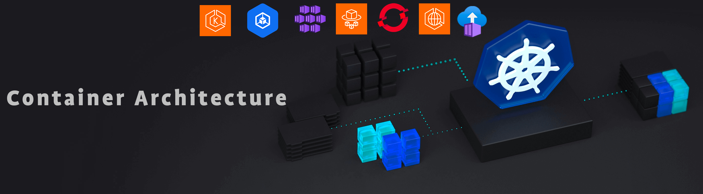

 

# Container Architectures and SonarQube Deployment Examples

Welcome to the **Container Architectures and SonarQube Deployment Examples** repository! This repository provides an overview of various container architectures and offers detailed examples of deploying SonarQube with different configurations.

## Introduction

Containers have revolutionized the way we develop, deploy, and manage applications. By encapsulating an application and its dependencies into a single unit that can run reliably across different computing environments, containers provide a consistent and efficient way to deploy software.

SonarQube is an open-source platform for continuous inspection of code quality. It performs automatic reviews to detect bugs, vulnerabilities, and code smells in your codebase. Deploying SonarQube in a containerized environment enhances its scalability and manageability, making it a perfect candidate for exploring various container architectures.

This repository aims to:
- Provide a clear understanding of different container architectures.
- Demonstrate how to deploy SonarQube using various container orchestration tools.
- Highlight different configuration options for SonarQube deployment.

## Contents

- [**Architecture Overviews**](Comparative_Document/README.md): Detailed explanations of various container architectures across different cloud providers
- [**SonarQube OpenShift**](Openshift/README.md): Deploying SonarQube in OpenShift.
- [**Securing SonarQube**](https://github.com/SonarSource-Demos/k8s-helm-sq-key): Encrypting JDBC Passwords with AES/GCM Key in Kubernetes.

